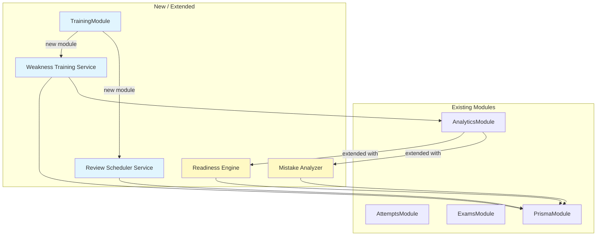

# Design Document: Advanced Analytics & Training

## Overview

This design covers the backend implementation for Phase 8 (Advanced Analytics & Readiness Strategy) and Phase 9 (Cognitive Training & Spaced Repetition) of the Brain Gym NestJS application. The frontend is already built by Lovable and expects specific REST API contracts.

The system introduces three new capabilities:

1. **Readiness Scoring Engine** — computes a composite readiness score per certification using exponential time-decay weighting of past exam attempts, plus per-domain confidence scores.
2. **Mistake Pattern Analytics** — allows learners to tag incorrect answers with a mistake category (CONCEPT, CARELESS, TRAP, TIME_PRESSURE) and view aggregated mistake pattern data.
3. **Cognitive Training Module** — generates adaptive weakness-focused mini-exams that over-sample from weak domains, and implements SM-2 spaced repetition for optimal review scheduling.

All new endpoints require JWT authentication and follow the existing NestJS module patterns (controller → service → PrismaService). The Prisma schema is extended with a `MistakeType` enum, an optional `mistakeType` field on `Answer`, and a new `ReviewSchedule` model.

## Architecture

The system extends the existing NestJS modular architecture. No new infrastructure is required — all features are backed by PostgreSQL via Prisma.



**Key architectural decisions:**

- **Extend AnalyticsModule** for readiness scoring and mistake patterns rather than creating separate modules. These are analytics concerns and the existing module already has the right dependencies.
- **New TrainingModule** for weakness training and spaced repetition. These are distinct from analytics — they create data (exams, schedules) rather than just reading it.
- **TrainingModule imports AnalyticsModule** to reuse `getDomains()` for weakness detection, avoiding logic duplication.
- **SM-2 algorithm lives in a pure function** within the training service for testability. No external library needed — SM-2 is a simple formula.

## Components and Interfaces

### Extended: AnalyticsController / AnalyticsService

New endpoints added to the existing analytics controller:

```
GET /analytics/readiness/:certificationId
```
- Auth: JWT required
- Params: `certificationId` (path)
- Response: `{ readinessScore, domainConfidences[], totalExams, weightedAvgScore }`

```
PATCH /answers/:answerId/mistake-type
```
- Auth: JWT required
- Body: `{ mistakeType: "CONCEPT" | "CARELESS" | "TRAP" | "TIME_PRESSURE" }`
- Validation: answer must belong to user's attempt, answer must be incorrect
- Response: updated Answer record

```
GET /analytics/mistake-patterns
```
- Auth: JWT required
- Query: `certificationId?` (optional filter)
- Response: `{ total, breakdown: { CONCEPT, CARELESS, TRAP, TIME_PRESSURE } }`

### New: TrainingController / TrainingService

```
POST /training/weakness/start
```
- Auth: JWT required
- Body: `{ certificationId, questionCount?: number }` (default 10)
- Logic: over-sample from weak domains, create Exam + ExamAttempt
- Response: same shape as `POST /exams/:examId/start`

```
POST /training/review
```
- Auth: JWT required
- Body: `{ questionId, quality: 0-5 }`
- Logic: upsert ReviewSchedule, apply SM-2 algorithm
- Response: updated ReviewSchedule record

```
GET /training/due-reviews
```
- Auth: JWT required
- Query: `certificationId?`, `limit?`
- Response: `ReviewSchedule[]` with nested Question data (choices without `isCorrect`)

### DTOs

```typescript
// analytics DTOs
class UpdateMistakeTypeDto {
  @IsEnum(MistakeType)
  mistakeType: MistakeType;
}

// training DTOs
class StartWeaknessTrainingDto {
  @IsUUID()
  certificationId: string;

  @IsOptional()
  @IsInt()
  @Min(1)
  @Max(50)
  questionCount?: number; // default 10
}

class SubmitReviewDto {
  @IsUUID()
  questionId: string;

  @IsInt()
  @Min(0)
  @Max(5)
  quality: number;
}
```

### Readiness Score Algorithm

The readiness score uses three components:

1. **Recency-weighted average score**: Each attempt's score is weighted by `e^(-λ * daysSinceAttempt)` where `λ = 0.05` (half-life ≈ 14 days). This ensures recent performance matters more.

2. **Domain confidence scores**: For each domain, aggregate correct/total across all attempts, yielding a percentage 0–100.

3. **Composite readiness score**: `readinessScore = 0.6 * weightedAvgScore + 0.2 * minDomainConfidence + 0.2 * examCountFactor` where `examCountFactor = min(examsTaken / 5, 1) * 100`. This penalizes uneven domain coverage and rewards sufficient practice volume.

### SM-2 Algorithm

Standard SuperMemo-2 implementation:

```
if quality >= 3:
  if repetitions == 0: interval = 1
  elif repetitions == 1: interval = 6
  else: interval = round(previousInterval * easeFactor)
  repetitions += 1
else:
  interval = 1
  repetitions = 0

easeFactor = easeFactor + (0.1 - (5 - quality) * (0.08 + (5 - quality) * 0.02))
easeFactor = max(easeFactor, 1.30)
nextReviewDate = today + interval days
```

### Weakness Training Question Selection

1. Fetch domain performance via `AnalyticsService.getDomains()` (already sorted weakest-first).
2. Assign selection weights inversely proportional to domain score: `weight = (100 - domainScore + 10)`. The +10 ensures even strong domains get some representation.
3. For each question slot, pick a domain using weighted random selection, then pick a random APPROVED question from that domain (not already selected).
4. If a user has no prior attempts, select uniformly at random across all domains.
5. If fewer approved questions exist than requested, return all available.

## Data Models

### Prisma Schema Changes

```prisma
// New enum
enum MistakeType {
  CONCEPT
  CARELESS
  TRAP
  TIME_PRESSURE
}

// Extended Answer model — add field:
model Answer {
  // ... existing fields ...
  mistakeType MistakeType? @map("mistake_type")
}

// New model
model ReviewSchedule {
  id             String   @id @default(uuid())
  userId         String   @map("user_id")
  questionId     String   @map("question_id")
  nextReviewDate DateTime @map("next_review_date")
  interval       Int      @default(0)
  easeFactor     Decimal  @default(2.50) @map("ease_factor") @db.Decimal(4, 2)
  repetitions    Int      @default(0)
  createdAt      DateTime @default(now()) @map("created_at")
  updatedAt      DateTime @updatedAt @map("updated_at")

  user     User     @relation(fields: [userId], references: [id], onDelete: Cascade)
  question Question @relation(fields: [questionId], references: [id], onDelete: Cascade)

  @@unique([userId, questionId])
  @@map("review_schedules")
}
```

The `User` and `Question` models need a `reviewSchedules ReviewSchedule[]` relation field added.

### Response Shapes

**Readiness Response:**
```json
{
  "readinessScore": 72,
  "domainConfidences": [
    { "domain": "Networking", "score": 85, "correct": 17, "total": 20 },
    { "domain": "Security", "score": 60, "correct": 12, "total": 20 }
  ],
  "totalExams": 8,
  "weightedAvgScore": 74
}
```

**Mistake Patterns Response:**
```json
{
  "total": 42,
  "breakdown": {
    "CONCEPT": 18,
    "CARELESS": 12,
    "TRAP": 8,
    "TIME_PRESSURE": 4
  }
}
```

**Due Reviews Response:**
```json
[
  {
    "id": "review-uuid",
    "questionId": "question-uuid",
    "nextReviewDate": "2025-01-15T00:00:00Z",
    "interval": 6,
    "easeFactor": 2.5,
    "repetitions": 2,
    "question": {
      "id": "question-uuid",
      "title": "...",
      "description": "...",
      "questionType": "SINGLE",
      "domain": { "id": "...", "name": "Networking" },
      "choices": [
        { "id": "...", "label": "A", "content": "..." }
      ]
    }
  }
]
```

## Correctness Properties

*A property is a characteristic or behavior that should hold true across all valid executions of a system — essentially, a formal statement about what the system should do. Properties serve as the bridge between human-readable specifications and machine-verifiable correctness guarantees.*

### Property 1: Readiness and domain scores are bounded 0–100

*For any* set of submitted ExamAttempt records (including empty sets), the computed readinessScore must be an integer in [0, 100] and every domainConfidence score must be an integer in [0, 100].

**Validates: Requirements 1.4, 1.5**

### Property 2: Time-decay weighting favors recent attempts

*For any* two ExamAttempt records with identical scores but different submission dates, the more recent attempt shall have a strictly higher weight in the recency-weighted average than the older attempt.

**Validates: Requirements 1.1**

### Property 3: Domain confidence equals aggregated correct/total ratio

*For any* set of submitted ExamAttempt records with domainScores, the Domain_Confidence for a given domain shall equal `round(totalCorrectInDomain / totalQuestionsInDomain * 100)`.

**Validates: Requirements 1.2**

### Property 4: Lower minimum domain confidence reduces readiness score

*For any* readiness computation, if the minimum Domain_Confidence score decreases while the weighted average score and exam count remain constant, the resulting readinessScore shall be less than or equal to the original readinessScore.

**Validates: Requirements 1.6**

### Property 5: Readiness response contains all required fields

*For any* valid authenticated request to the readiness endpoint with a valid certificationId, the response shall contain `readinessScore` (integer), `domainConfidences` (array of objects with domain, score, correct, total), `totalExams` (integer), and `weightedAvgScore` (number).

**Validates: Requirements 2.2**

### Property 6: Mistake type update round trip

*For any* incorrect Answer belonging to the authenticated user's ExamAttempt and any valid MistakeType value, after a successful PATCH to update the mistakeType, reading the Answer record shall return the same MistakeType value.

**Validates: Requirements 3.3**

### Property 7: Mistake type tagging rejected for correct answers

*For any* Answer where isCorrect is true, a PATCH request to set a mistakeType shall be rejected, and the Answer record shall remain unchanged.

**Validates: Requirements 3.6**

### Property 8: Mistake type tagging rejected for other users' answers

*For any* Answer belonging to a different user's ExamAttempt, a PATCH request to set a mistakeType shall return HTTP 403, and the Answer record shall remain unchanged.

**Validates: Requirements 3.4**

### Property 9: Mistake pattern counts are consistent

*For any* set of tagged Answer records for a user, the mistake patterns endpoint shall return per-type counts that match the actual count of each MistakeType in the database, and the `total` field shall equal the sum of all per-type counts (CONCEPT + CARELESS + TRAP + TIME_PRESSURE).

**Validates: Requirements 4.2, 4.4**

### Property 10: Mistake pattern certification filter correctness

*For any* certificationId filter, all Answer records counted in the mistake patterns response shall belong to ExamAttempt records whose exam is associated with the specified certification. No answers from other certifications shall be included.

**Validates: Requirements 4.3**

### Property 11: Weakness training over-samples from weak domains

*For any* user with at least two domains of differing performance and a sufficiently large questionCount, the generated Weakness_Exam shall contain proportionally more questions from lower-scoring domains than from higher-scoring domains.

**Validates: Requirements 5.3**

### Property 12: Weakness training selects uniformly without prior history

*For any* user with zero submitted ExamAttempt records for a certification, the weakness training question selection shall not systematically favor any domain over another (uniform distribution across domains).

**Validates: Requirements 5.6**

### Property 13: Weakness training only selects APPROVED questions

*For any* generated Weakness_Exam, every question in the exam shall have a status of APPROVED.

**Validates: Requirements 5.7**

### Property 14: SM-2 algorithm produces correct interval, repetitions, and nextReviewDate

*For any* current ReviewSchedule state (interval, easeFactor, repetitions) and any quality rating (0–5): if quality >= 3, the new interval shall be 1 (first rep), 6 (second rep), or `round(prevInterval * easeFactor)` (subsequent), and repetitions shall increment by 1; if quality < 3, interval shall reset to 1 and repetitions to 0. In all cases, nextReviewDate shall equal today + new interval days.

**Validates: Requirements 7.3, 7.4, 7.6**

### Property 15: EaseFactor never drops below 1.30

*For any* quality rating (0–5) and any current easeFactor, after applying the SM-2 easeFactor formula `ef + (0.1 - (5 - q) * (0.08 + (5 - q) * 0.02))`, the resulting easeFactor shall be at least 1.30.

**Validates: Requirements 7.5**

### Property 16: Due reviews returns only records with nextReviewDate on or before today

*For any* set of ReviewSchedule records for a user, the due-reviews endpoint shall return exactly those records where nextReviewDate <= current date, and no records where nextReviewDate > current date.

**Validates: Requirements 8.2**

### Property 17: Due reviews include question data without isCorrect

*For any* due review item returned, the nested question object shall include title, description, questionType, domain, and choices, and no choice object shall contain an `isCorrect` field.

**Validates: Requirements 8.3**

### Property 18: Due reviews certification filter correctness

*For any* certificationId query parameter, all returned due review items shall have questions belonging to the specified certification. No questions from other certifications shall be included.

**Validates: Requirements 8.4**

### Property 19: Due reviews respects limit and orders by nextReviewDate ascending

*For any* limit parameter value N and any set of due reviews, the returned array shall contain at most N items, and the items shall be ordered by nextReviewDate ascending (oldest due first).

**Validates: Requirements 8.5**

## Error Handling

| Scenario | HTTP Status | Response |
|---|---|---|
| Unauthenticated request to any protected endpoint | 401 | `{ "message": "Invalid or missing token" }` |
| `GET /analytics/readiness/:certificationId` with non-existent certification | 404 | `{ "message": "Certification not found" }` |
| `PATCH /answers/:answerId/mistake-type` with non-existent answer | 404 | `{ "message": "Answer not found" }` |
| `PATCH /answers/:answerId/mistake-type` on another user's answer | 403 | `{ "message": "Forbidden" }` |
| `PATCH /answers/:answerId/mistake-type` on a correct answer | 400 | `{ "message": "Can only tag mistakes on incorrect answers" }` |
| `PATCH /answers/:answerId/mistake-type` with invalid MistakeType value | 400 | Validation pipe error (class-validator) |
| `POST /training/weakness/start` with non-existent certification | 404 | `{ "message": "Certification not found" }` |
| `POST /training/weakness/start` with no approved questions | 404 | `{ "message": "No approved questions available" }` |
| `POST /training/review` with invalid quality (not 0–5) | 400 | Validation pipe error (class-validator) |
| `POST /training/review` with non-existent question | 404 | `{ "message": "Question not found" }` |

All errors follow the existing NestJS exception filter pattern (`AllExceptionsFilter` in `backend/src/common/filters/`). Standard NestJS exceptions (`NotFoundException`, `ForbiddenException`, `BadRequestException`) are used throughout.

## Testing Strategy

### Property-Based Testing

The project uses Jest as its test runner. For property-based testing, use **fast-check** (`fc` from `fast-check` npm package) which integrates seamlessly with Jest.

Each property-based test must:
- Run a minimum of 100 iterations
- Reference its design property in a comment tag
- Use `fc.assert(fc.property(...))` pattern

Configuration:
```typescript
import fc from 'fast-check';

// Example structure for each property test
// Feature: advanced-analytics-training, Property 1: Readiness and domain scores are bounded 0–100
it('readiness and domain scores are bounded 0-100', () => {
  fc.assert(
    fc.property(
      arbitraryExamAttempts(), // custom arbitrary
      (attempts) => {
        const result = computeReadiness(attempts);
        return result.readinessScore >= 0 && result.readinessScore <= 100
          && result.domainConfidences.every(d => d.score >= 0 && d.score <= 100);
      }
    ),
    { numRuns: 100 }
  );
});
```

### Property Test Plan

| Property | Test Focus | Key Arbitraries |
|---|---|---|
| P1: Score bounds | Pure function test on `computeReadiness` | Random attempt arrays with scores 0–100, random dates |
| P2: Time-decay weighting | Pure function test on weight calculation | Pairs of dates, verify weight ordering |
| P3: Domain confidence aggregation | Pure function test | Random domain score maps |
| P4: Min domain penalizes readiness | Metamorphic test on `computeReadiness` | Two input sets differing only in min domain |
| P5: Response shape | Integration test via supertest | Random certification + attempt state |
| P6: Mistake type round trip | Integration test | Random MistakeType values |
| P7: Correct answer rejection | Service-level test | Random correct answers + MistakeType |
| P8: Ownership enforcement | Service-level test | Two random users, cross-attempt access |
| P9: Mistake pattern counts | Pure function / service test | Random tagged answer sets |
| P10: Certification filter | Service-level test | Answers across multiple certifications |
| P11: Weakness over-sampling | Statistical test on selection function | Random domain scores, verify distribution |
| P12: Uniform selection | Statistical test | No prior attempts, verify no domain bias |
| P13: APPROVED only | Service-level test | Mix of APPROVED/DRAFT/PENDING questions |
| P14: SM-2 correctness | Pure function test on SM-2 | Random (interval, ef, reps, quality) tuples |
| P15: EaseFactor minimum | Pure function test | Random quality 0–5, random easeFactor |
| P16: Due date filter | Service-level test | Random review schedules with various dates |
| P17: No isCorrect in response | Integration test | Due reviews response inspection |
| P18: Certification filter (reviews) | Service-level test | Reviews across certifications |
| P19: Limit and ordering | Service-level test | Random limit values, verify count and order |

### Unit Tests

Unit tests complement property tests for specific examples and edge cases:

- Zero attempts → readiness score 0, empty domain list (edge case from 1.3)
- Zero tagged mistakes → all counts 0 (edge case from 4.5)
- Fewer questions than requested → returns all available (edge case from 5.5)
- No due reviews → empty array (edge case from 8.6)
- Non-existent certification → 404 (example from 2.3)
- Non-existent answer → 404 (example from 3.5)
- SM-2 first repetition: quality=4, reps=0 → interval=1 (specific example)
- SM-2 second repetition: quality=4, reps=1 → interval=6 (specific example)
- SM-2 quality=2 reset: interval→1, reps→0 (specific example)
- ReviewSchedule unique constraint violation (example from 6.2)
- Cascade delete on user/question removal (example from 6.3)

### Test File Organization

```
backend/src/analytics/__tests__/
  readiness.service.spec.ts        # P1–P5 + unit tests
  mistake-patterns.service.spec.ts # P6–P10 + unit tests
backend/src/training/__tests__/
  weakness-training.service.spec.ts # P11–P13 + unit tests
  sm2-algorithm.spec.ts             # P14–P15 + unit tests
  review-scheduler.service.spec.ts  # P16–P19 + unit tests
```

### Dependencies

Add to `backend/package.json` devDependencies:
```json
"fast-check": "^3.22.0"
```
