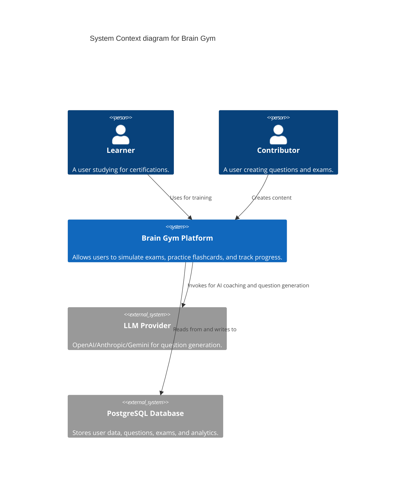
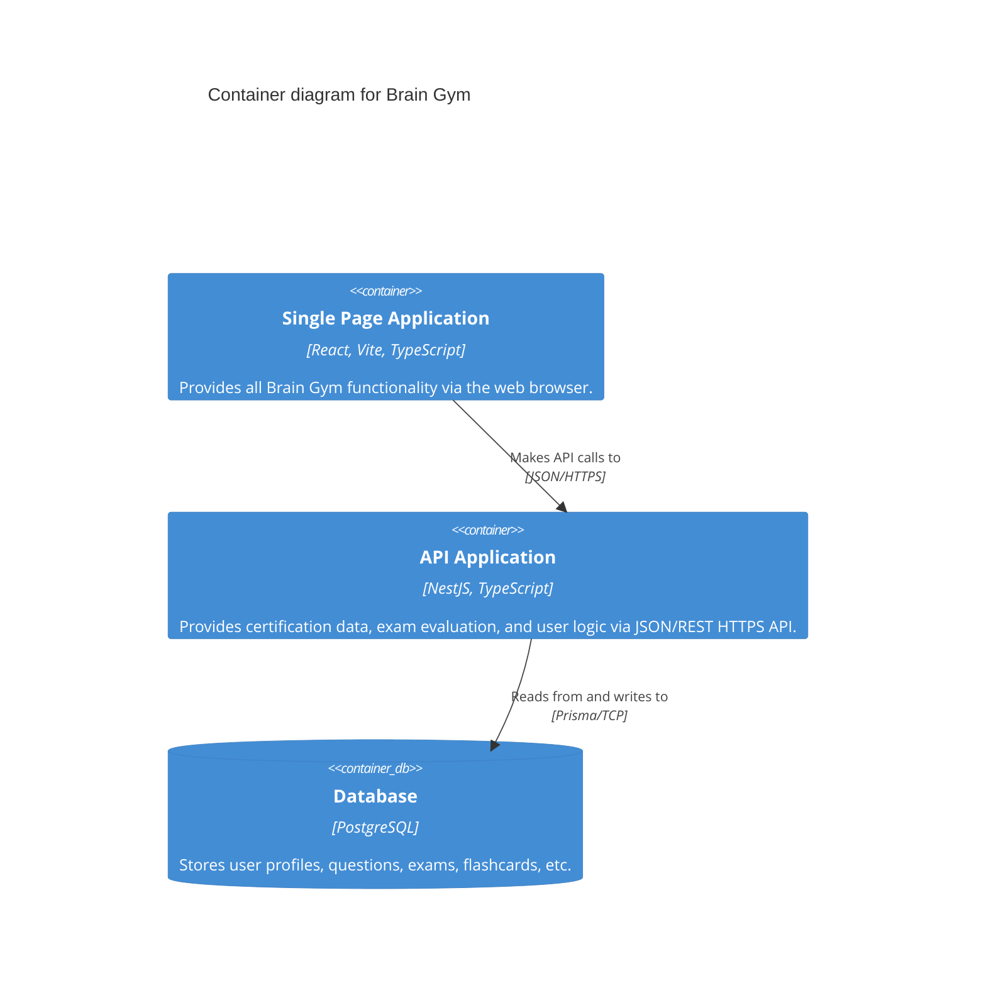

# 01 - Architecture Overview

## 1. High-Level System Architecture (C4 Context)

Brain Gym operates as a modern client-server web application. It connects learners, contributors, and reviewers to a centralized platform for certification exam preparation.

## 2. Container Architecture

The system is broken down into three primary containers: a Frontend SPA, a Backend API, and a Database.

## 3. Technology Stack

### 3.1 Frontend
- **Framework:** React 18, Vite
- **Language:** TypeScript
- **State Management:** Zustand (Global State), React Query (Server State)
- **Styling:** Tailwind CSS, UI component library (shadcn/ui)
- **Routing:** React Router

### 3.2 Backend
- **Framework:** NestJS
- **Language:** TypeScript
- **ORM:** Prisma
- **Database:** PostgreSQL
- **Authentication:** JWT (JSON Web Tokens)
- **API Documentation:** Swagger / OpenAPI

### 3.3 Infrastructure & Deployment
- **Containerization:** Docker & Docker Compose
- **Web Server / Proxy:** Nginx (for Frontend hosting and reversing API traffic)
- **Package Manager:** npm / bun

## 4. Sub-Systems
As defined in the product vision, the architecture supports three conceptual sub-systems:
1.  **Question Bank System:** Curated, version-controlled repository of certification questions.
2.  **Simulation Engine:** Zero-distraction environment to simulate real exam scenarios.
3.  **Analytics & Intelligence:** Spaced repetition (SM-2) engine, and AI integrations (LLM configuration by user).
