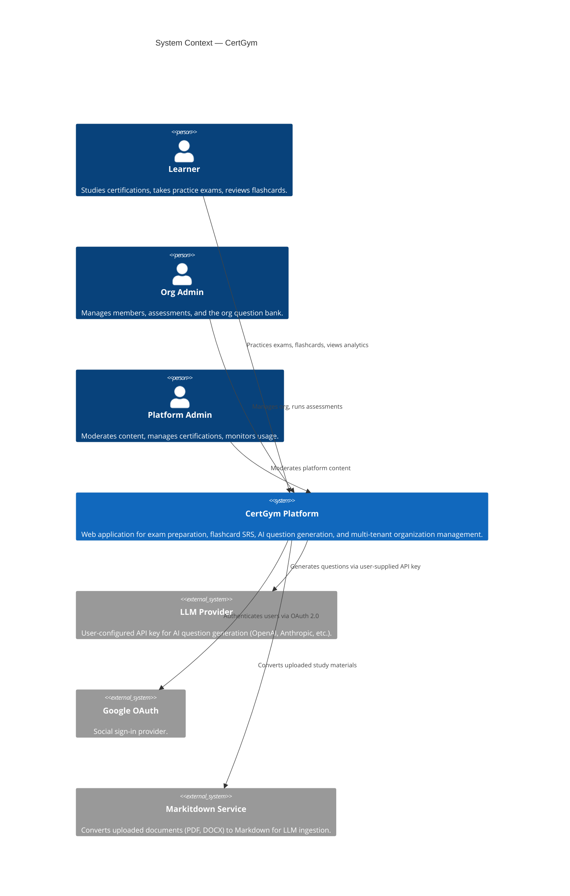
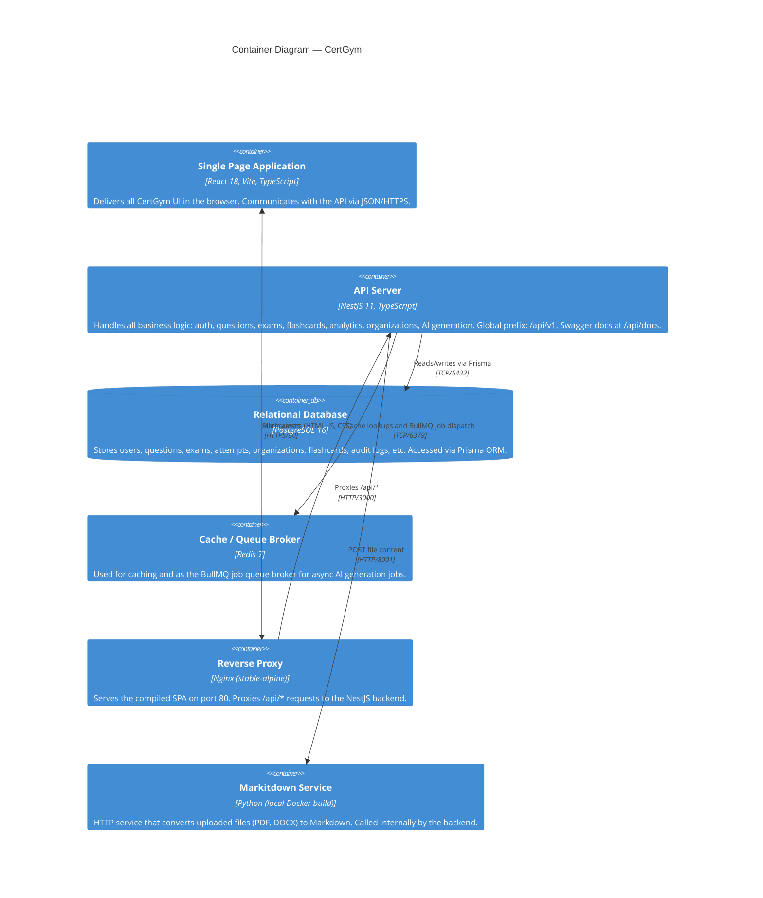

# 01 - Architecture Overview

## 1. System Context (C4 Context)

CertGym is a community-driven certification exam preparation platform. Users study for certifications via flashcards, practice exams, and AI-generated questions. Organizations use the platform to assess and track their members' readiness.

## 2. Container Architecture (C4 Container)

## 3. Infrastructure & Deployment

### 3.1 Local Development

| Service | Host | Port |
|---------|------|------|
| Frontend (Vite dev server) | localhost | 8080 |
| Backend (NestJS) | localhost | 3000 |
| PostgreSQL | localhost | 5432 |
| Redis | localhost | 6379 |

In development, the Vite dev server proxies `/api` calls to `localhost:3000` so CORS issues are avoided. The `VITE_API_BASE_URL` environment variable overrides the default `/api/v1` base URL.

### 3.2 Production (Docker Compose)

Six services are defined in `docker-compose.yml`:

| Container | Image / Build | Role |
|-----------|---------------|------|
| `braingym-nginx` | `nginx:stable-alpine` | Public entry point on port 80 |
| `braingym-frontend` | Built from root `Dockerfile` | Compiled SPA served by Nginx |
| `braingym-backend` | Built from `backend/Dockerfile` | NestJS API on internal port 3000 |
| `braingym-postgres` | `postgres:16-alpine` | Primary data store |
| `braingym-redis` | `redis:7-alpine` | Cache and queue broker |
| `braingym-markitdown` | Built from `lambda/markitdown/Dockerfile.local` | Document conversion service |

The backend requires `JWT_SECRET`, `JWT_REFRESH_SECRET`, and `DATABASE_URL` to start. It validates these at bootstrap and throws if any are missing.

### 3.3 Required Environment Variables (Backend)

| Variable | Purpose |
|----------|---------|
| `DATABASE_URL` | PostgreSQL connection string |
| `JWT_SECRET` | Signing secret for access tokens (15 min default) |
| `JWT_REFRESH_SECRET` | Signing secret for refresh tokens (7 day default) |
| `LLM_KEY_ENCRYPTION_SECRET` | AES key used to encrypt user-supplied LLM API keys at rest |
| `REDIS_HOST` / `REDIS_PORT` | Redis connection |
| `MARKITDOWN_LOCAL_URL` | Internal URL for the Markitdown service |
| `CORS_ORIGINS` | Comma-separated allowed origins (falls back to localhost for dev) |

## 4. Technology Stack

### 4.1 Frontend

| Concern | Library / Version |
|---------|------------------|
| Framework | React 18.3 |
| Build tool | Vite 5.4 (SWC plugin) |
| Language | TypeScript 5.8 (`noImplicitAny: false`, `strictNullChecks: false`) |
| Routing | React Router v6.30 |
| Server state | TanStack Query v5.83 |
| Client state | Zustand v5.0 |
| UI components | shadcn/ui (Radix UI primitives) |
| Styling | Tailwind CSS v3.4 |
| Animations | Framer Motion v12 |
| Forms | React Hook Form v7 + Zod v3 |
| HTTP client | Axios v1.13 |

### 4.2 Backend

| Concern | Library / Version |
|---------|------------------|
| Framework | NestJS 11 |
| Language | TypeScript |
| ORM | Prisma (PostgreSQL 16) |
| Authentication | Passport.js — JWT strategy (access + refresh tokens) |
| Job queues | BullMQ (Redis-backed) via `QueuesModule` |
| Rate limiting | `@nestjs/throttler` — 300 requests / 60 s globally |
| API documentation | Swagger / OpenAPI at `/api/docs` |
| Row-level security | `RlsInterceptor` — sets tenant context on every request |

## 5. Backend Module Map

The NestJS application is composed of the following modules registered in `AppModule`:

### Core Infrastructure
- `PrismaModule` — shared Prisma client
- `RedisModule` — shared Redis client
- `QueuesModule` — BullMQ job queues (used by AI generation)
- `AuditModule` — audit event recording
- `MailModule` — transactional email

### Identity & Access
- `AuthModule` — JWT login, refresh, Google OAuth
- `UsersModule` — user profiles, settings
- `OrganizationsModule` — multi-tenant org management
- `AdminModule` — platform admin operations

### Certification Content
- `CertificationsModule` — certification catalog and domains
- `ProvidersModule` — certification body registry (e.g., AWS, Azure)
- `QuestionsModule` — community question CRUD, voting, versioning
- `TagsModule` — tagging taxonomy
- `ExamsModule` — exam builder and configuration
- `AttemptsModule` — exam simulation and attempt recording
- `ExamCatalogModule` — org-scoped exam catalog
- `OrgQuestionsModule` — org-private question bank

### Learning & SRS
- `FlashcardsModule` — deck and card management; SM-2 scheduling
- `TrainingModule` — training hub and AI coach sessions
- `MasteryModule` — per-domain mastery scoring
- `KnowledgeGraphModule` — topic relationship graph
- `CaptureModule` — in-exam word / concept capture

### Analytics & Intelligence
- `AnalyticsModule` — user score trends and weak-topic analysis
- `OrgAnalyticsModule` — org-level member readiness analytics
- `InsightsModule` — automated study insights
- `PassLikelihoodModule` (surveys) — pass-likelihood survey collection
- `AiQuestionBankModule` — LLM-backed question generation jobs

### Gamification & Social
- `GamificationModule` — points, badges, leaderboard
- `SquadsModule` — peer study groups
- `CommentsModule` — question discussion threads
- `ReportsModule` — content moderation reports
- `EventsModule` — platform event bus

### Org Features
- `AssessmentsModule` — candidate assessment workflows
- `JobRolesModule` — org job-role definitions
- `CompetencyModule` — competency framework
- `StreamsModule` — org learning tracks (registered as `OrgAnalyticsModule`)
