# 02 - Data Model

CertGym uses **PostgreSQL 16** configured via **Prisma ORM**. The schema lives at `backend/prisma/schema.prisma` (single file, ~1644 lines). All table names are snake_case via `@@map`; Prisma model names are PascalCase.

---

## 1. High-Level Entity Relationship Diagram

```mermaid
erDiagram
    User ||--o{ OAuthAccount : "oauth"
    User ||--o{ Question : "authors"
    User ||--o{ Exam : "creates"
    User ||--o{ ExamAttempt : "takes"
    User ||--o{ Deck : "owns"
    User ||--o{ OrgMember : "joins"
    User ||--o{ BadgeAward : "earns"
    User ||--o{ ReviewSchedule : "srs"
    User ||--o{ FlashcardReviewSchedule : "srs"
    User ||--o{ QuestionGenerationJob : "triggers"
    User ||--o{ SourceMaterial : "uploads"
    User ||--o{ CoachSession : "chats"
    User ||--o{ ReadinessScore : "scored"
    User ||--o{ UserReputation : "reputation"

    Provider ||--o{ Certification : "offers"
    Certification ||--o{ Domain : "contains"
    Certification ||--o{ Question : "has"
    Certification ||--o{ Exam : "has"
    Certification ||--o{ Deck : "scope"

    Question ||--o{ Choice : "has"
    Question ||--o{ QuestionTag : "tagged"
    Tag ||--o{ QuestionTag : "used by"
    Exam ||--o{ ExamQuestion : "includes"
    ExamQuestion }o--|| Question : "links"
    ExamAttempt ||--o{ Answer : "contains"
    ExamAttempt ||--o{ AttemptEvent : "logs"
    ExamAttempt ||--o{ CapturedWord : "captures"

    Deck ||--o{ Flashcard : "contains"
    Flashcard ||--o| FlashcardReviewSchedule : "tracked by"
    Question ||--o{ ReviewSchedule : "tracked by"

    Organization ||--o{ OrgMember : "has"
    Organization ||--o{ OrgGroup : "groups"
    Organization ||--o{ OrgInvite : "invites"
    Organization ||--o{ OrgJoinLink : "links"
    Organization ||--o{ OrgQuestion : "private bank"
    Organization ||--o{ ExamCatalogItem : "catalog"
    Organization ||--o{ Assessment : "assessments"
    Organization ||--o{ JobRole : "roles"
    Organization ||--o{ LearningTrack : "tracks"
    Organization ||--o{ Scenario : "scenarios"
    Organization ||--o{ Competency : "competencies"

    Assessment ||--o{ AssessmentQuestion : "questions"
    Assessment ||--o{ CandidateInvite : "invites"
    CandidateInvite ||--o{ CandidateAnswer : "answers"
    CandidateInvite ||--o{ CandidateEvent : "events"

    JobRole ||--o{ JobRoleCompetency : "requires"
    Competency ||--o{ JobRoleCompetency : "used in"
    Competency ||--o{ CompetencyDomain : "domains"
    Competency ||--o{ QuestionCompetency : "maps"
    OrgQuestion ||--o{ QuestionCompetency : "mapped"

    Question ||--o| QuestionEmbedding : "vector"
    Question ||--o{ QuestionVariant : "dds variants"
    Certification ||--o{ CertOverlap : "overlaps"

    SourceMaterial ||--o{ SourceChunk : "chunks"
    SourceChunk ||--o{ Question : "sourced"
```

---

## 2. Enums

### Identity & Status

| Enum | Values | Used On |
|------|--------|---------|
| `UserRole` | `LEARNER`, `CONTRIBUTOR`, `REVIEWER`, `ADMIN` | `User.role` |
| `UserStatus` | `ACTIVE`, `SUSPENDED`, `BANNED` | `User.status` |
| `UserPlan` | `FREE`, `PREMIUM`, `ENTERPRISE` | `User.plan` |

### Content Quality & Status

| Enum | Values | Used On |
|------|--------|---------|
| `QuestionType` | `SINGLE`, `MULTIPLE` | `Question.questionType`, `OrgQuestion.questionType` |
| `Difficulty` | `EASY`, `MEDIUM`, `HARD` | `Question.difficulty`, `OrgQuestion.difficulty`, `QuestionGenerationJob.difficulty` |
| `QuestionStatus` | `DRAFT`, `PENDING`, `APPROVED`, `REJECTED`, `REMOVED` | `Question.status` |
| `OrgQuestionStatus` | `DRAFT`, `UNDER_REVIEW`, `APPROVED`, `REJECTED` | `OrgQuestion.status` |
| `QualityTier` | `HIGH`, `MEDIUM`, `LOW` | `Question.qualityTier` |
| `ModerationAction` | `ACCEPTED`, `REJECTED` | `ModerationAudit.action` |

### Exam & Attempt

| Enum | Values | Used On |
|------|--------|---------|
| `ExamVisibility` | `PUBLIC`, `PRIVATE`, `LINK` | `Exam.visibility` |
| `AttemptStatus` | `IN_PROGRESS`, `SUBMITTED`, `ABANDONED` | `ExamAttempt.status` |
| `ExamType` | `STANDARD`, `TIME_PRESSURE` | `ExamAttempt.examType` |
| `TimerMode` | `STRICT`, `ACCELERATED`, `RELAXED`, `TIME_PRESSURE` | `Exam.timerMode`, `ExamCatalogItem.timerMode` |
| `MistakeType` | `CONCEPT`, `CARELESS`, `TRAP`, `TIME_PRESSURE` | `Answer.mistakeType` |

### Spaced Repetition

| Enum | Values | Used On |
|------|--------|---------|
| `FlashcardMastery` | `NEW`, `LEARNING`, `REVIEW`, `MASTERED` | `ReviewSchedule.mastery`, `FlashcardReviewSchedule.mastery` |
| `FlashcardSource` | `MANUAL`, `EXAM_CAPTURE` | `Flashcard.source` |

### Community & Reporting

| Enum | Values | Used On |
|------|--------|---------|
| `VoteTargetType` | `QUESTION`, `COMMENT`, `EXPLANATION` | `Vote.targetType` |
| `ReportReason` | `WRONG_ANSWER`, `OUTDATED`, `DUPLICATE`, `INAPPROPRIATE` | `Report.reason` |
| `ReportStatus` | `PENDING`, `RESOLVED`, `DISMISSED` | `Report.status` |

### AI & Generation

| Enum | Values | Used On |
|------|--------|---------|
| `LlmProvider` | `OPENAI`, `ANTHROPIC`, `GEMINI` | `UserLlmConfig.provider`, `QuestionGenerationJob.provider` |
| `GenerationJobStatus` | `PENDING`, `PROCESSING`, `COMPLETED`, `FAILED` | `QuestionGenerationJob.status` |
| `MaterialContentType` | `PDF`, `URL`, `TEXT`, `DOCX`, `PPTX`, `XLSX` | `SourceMaterial.contentType` |

### DDS (Dynamic Distractor System)

| Enum | Values | Used On |
|------|--------|---------|
| `DdsReason` | `DDS_HARDEN`, `DDS_SOFTEN`, `MANUAL` | `QuestionVariant.reason` |
| `DdsVariantStatus` | `PENDING`, `APPROVED`, `REJECTED`, `ROLLED_BACK` | `QuestionVariant.status` |

### Enterprise & Organization

| Enum | Values | Used On |
|------|--------|---------|
| `OrgKind` | `ORG`, `SQUAD` | `Organization.kind` |
| `OrgRole` | `OWNER`, `ADMIN`, `MANAGER`, `RECRUITER`, `MEMBER` | `OrgMember.role`, `OrgInvite.role` |
| `OrgInviteStatus` | `PENDING`, `ACCEPTED`, `EXPIRED`, `REVOKED` | `OrgInvite.status` |
| `AssessmentStatus` | `DRAFT`, `ACTIVE`, `CLOSED`, `ARCHIVED` | `Assessment.status` |
| `AssessmentSelectionMode` | `MANUAL`, `BLUEPRINT`, `POOL` | `Assessment.selectionMode` |
| `CandidateAttemptStatus` | `INVITED`, `STARTED`, `SUBMITTED`, `EXPIRED` | `CandidateInvite.status` |
| `CandidateStage` | `APPLIED`, `SCREENING`, `SHORTLISTED`, `REJECTED`, `HIRED` | `CandidateInvite.stage` |
| `ExamCatalogItemType` | `FIXED`, `DYNAMIC` | `ExamCatalogItem.type` |

### Competency

| Enum | Values | Used On |
|------|--------|---------|
| `CompetencyDomainSource` | `ORG_QUESTION_CATEGORY`, `PUBLIC_DOMAIN` | `CompetencyDomain.source` |

---

## 3. Domain Sections

### 3.1 Identity & Access Management

| Model | Table | Description |
|-------|-------|-------------|
| `User` | `users` | All platform actors. Holds role (`UserRole`), status (`UserStatus`), plan (`UserPlan`), gamification `points`, per-user `featureFlags` (JSON), `preferences` (JSON), and `subscriptionTier` string. |
| `OAuthAccount` | `oauth_accounts` | Third-party OAuth links (Google, etc.) for a user. Composite unique on `(provider, providerUserId)`. Cascades on user delete. |

**Key fields on `User`:**
- `featureFlags Json` — per-user feature flag overrides, default `{}`.
- `preferences Json` — settings such as `digestEnabled`, `coachEnabled`.
- `subscriptionTier String` — free-form string (`"free"`, `"pro"`, `"enterprise"`), separate from the `UserPlan` enum.
- `suspendedUntil DateTime?` / `banReason String?` — soft-moderation fields.

---

### 3.2 Content Taxonomy

| Model | Table | Description |
|-------|-------|-------------|
| `Provider` | `providers` | Exam vendors (e.g., AWS, Microsoft). Has `slug`, `logoUrl`, `isActive`, `sortOrder`. |
| `Certification` | `certifications` | A specific certification (e.g., AWS SAA-C03). References `Provider`. Has `code` (unique), `examFormat Json`, `examStyle`, `passingScore`, `isActive`. |
| `Domain` | `domains` | Topic area within a certification. Has `weight Decimal(5,2)`. Cascades on certification delete. |
| `Tag` | `tags` | Cross-cutting labels. Unique on `(name, certificationId)` — a tag may be cert-scoped or global (`certificationId` nullable). |
| `QuestionTag` | `question_tags` | Junction table linking `Question` to `Tag`. Composite PK `(questionId, tagId)`. Both sides cascade on delete. |

---

### 3.3 Question Bank

| Model | Table | Description |
|-------|-------|-------------|
| `Question` | `questions` | Core learning primitive. Tracks `questionType`, `difficulty`, `status`, vote counters (`upvotes`, `downvotes`), performance counters (`attemptCount`, `correctCount`), AI provenance (`isAiGenerated`, `generationJobId`, `sourceChunkId`), and `qualityTier`. Soft-deleted via `deletedAt`. |
| `Choice` | `choices` | Answer options for a question. `label` is a single `CHAR(1)` (A–D). `isCorrect` marks the correct answer(s). `sortOrder` controls display order. Cascades on question delete. |
| `Comment` | `comments` | Threaded discussion on a question. Self-referential via `parentId` (reply tree). Cascades on question delete. |
| `Vote` | `votes` | Polymorphic upvote/downvote on `QUESTION`, `COMMENT`, or `EXPLANATION`. `value` is a `SmallInt` (+1 / -1). Unique per `(userId, targetType, targetId)`. |
| `Report` | `reports` | User flag on a question with a `ReportReason` and lifecycle `ReportStatus`. |
| `ModerationAudit` | `moderation_audits` | Immutable audit record for every Reviewer Queue accept/reject action. `reason` is required (≥ 10 chars) for `REJECTED` actions. Cascades on question delete. |
| `QuestionEmbedding` | `question_embeddings` | 1:1 with `Question`. Stores the LLM model ID used for embedding. The actual `vector(1536)` column is added via raw SQL migration (pgvector). Cascades on question delete. |
| `QuestionVariant` | `question_variants` | DDS (Dynamic Distractor System) audit trail. Each row is an LLM-proposed choice rewrite. `diff Json` stores `{ originalChoices, revisedChoices }`. Supports rollback chain via `variantOf`. |

**Indexes on `Question`:** `deletedAt`, `status`, `(certificationId, status)`.

---

### 3.4 Simulation Engine

| Model | Table | Description |
|-------|-------|-------------|
| `Exam` | `exams` | A named set of questions forming a practice exam. Has `visibility` (`ExamVisibility`), `timerMode` (`TimerMode`), optional `shareCode` (unique), `isAdaptive`, and aggregate stats (`attemptCount`, `avgScore`). |
| `ExamQuestion` | `exam_questions` | Junction table linking `Exam` to `Question` with `sortOrder`. Composite PK `(examId, questionId)`. Exam-side cascades on delete. |
| `ExamAttempt` | `exam_attempts` | A single user run of an exam. Tracks `status` (`AttemptStatus`), `examType` (`ExamType`), `score`, `timeSpent`, `totalCorrect`, `totalQuestions`, and `domainScores Json`. |
| `Answer` | `answers` | Per-question response within an attempt. `selectedChoices String[]` stores choice IDs. `mistakeType` (`MistakeType`) is set post-grading. Cascades on attempt delete. |
| `AttemptEvent` | `attempt_events` | Fine-grained event log for an attempt (tab focus, question navigation, etc.). `payload Json` + `clientTs` for client-side timestamps. Cascades on attempt delete. |

---

### 3.5 Spaced Repetition & Flashcards

| Model | Table | Description |
|-------|-------|-------------|
| `Deck` | `decks` | User-owned flashcard collection, optionally scoped to a certification. Cascades on user delete. |
| `Flashcard` | `flashcards` | A card with `front`, `back`, optional `hint`, string `tags[]`, and `source` (`FlashcardSource`). `isStarred` for bookmarking. Cascades on deck delete. |
| `FlashcardReviewSchedule` | `flashcard_review_schedules` | SM-2 SRS state for a flashcard. 1:1 with `Flashcard` (`flashcardId` is unique). Tracks `intervalDays`, `easeFactor Decimal(4,2)`, `repetitions`, `lapses`, `mastery` (`FlashcardMastery`), `nextReviewDate`. Indexed on `(userId, nextReviewDate)` and `(userId, mastery)`. |
| `ReviewSchedule` | `review_schedules` | SM-2 SRS state for a public `Question` (not flashcard). Adds `lastQuality Int?` and `lastReviewedAt` beyond the flashcard schedule. Unique on `(userId, questionId)`. Indexed on `(userId, nextReviewDate)`. |
| `CapturedWord` | `captured_words` | Mid-exam vocabulary captures stored for later review. `status String` defaults to `"pending"`. Linked to both `ExamAttempt` and `Question` (both nullable). |

---

### 3.6 AI & Generation

| Model | Table | Description |
|-------|-------|-------------|
| `UserLlmConfig` | `user_llm_configs` | BYOK (Bring Your Own Key) credentials for a user. `encryptedKey` is stored encrypted. `modelId` is optional override. Unique on `(userId, provider)`. |
| `SourceMaterial` | `source_materials` | Uploaded study material (`PDF`, `URL`, `TEXT`, `DOCX`, `PPTX`, `XLSX`). Tracks processing `status String` and `chunkCount`. |
| `SourceChunk` | `source_chunks` | A parsed, indexed text segment from a `SourceMaterial`. Stores `chunkIndex`, `pageNumber`, `sectionTitle`, `tokenCount`. Cascades on material delete. |
| `QuestionGenerationJob` | `question_generation_jobs` | Background job that produces AI-generated questions. Tracks `status` (`GenerationJobStatus`), token usage (`promptTokens`, `completionTokens`), `qualityScores Json`, `previewData Json`, and optional `orgId` for cost attribution. |
| `LlmUsageEvent` | `llm_usage_events` | LLM cost ledger. One row per AI call with `inputTokens`, `outputTokens`, `costUsd Decimal(10,6)`, and `feature` string. Indexed on `(userId, createdAt)` and `(orgId, createdAt)`. |

---

### 3.7 Analytics & Intelligence

| Model | Table | Description |
|-------|-------|-------------|
| `ReadinessScore` | `readiness_scores` | Pass-predictor output. One row per `(userId, certificationId)`. `score 0–100`, `confidence Decimal(4,3)`. `signals Json` contains `{ srsCoverage, recentAccuracy14d, domainSpread, timePressure }`. Upserted by the `readiness:recompute` job. |
| `PassLikelihoodSurvey` | `pass_likelihood_surveys` | Self-reported pass confidence from a user. `score` is 1–10. One row per `(userId, certificationId)`. |
| `BehavioralInsight` | `behavioral_insights` | Nightly computed behavioral patterns per `(userId, certId, kind, generatedFor)`. `kind` is a string (`"slow_on_long_stems"`, `"accuracy_decline_after_30min"`, `"domain_streak_break"`). `payload Json` shape varies by kind. `generatedFor` is a `Date` for idempotency. |
| `CertOverlap` | `cert_overlaps` | Cached cross-certification domain overlap scores from the knowledge graph job. `overlapPct Float` (0.0–1.0), `sharedTopics Json` (string array). Unique on `(certAId, certBId, domainAId, domainBId)`. |
| `StudyPlan` | `study_plans` | Persisted study plan generated from knowledge graph overlap. `sourceCertIds String[]`, `skipTopics Json`, `mustLearnTopics Json`, `effortReductionPct Int`. Each generation creates a new row. |

---

### 3.8 Gamification

| Model | Table | Description |
|-------|-------|-------------|
| `Badge` | `badges` | Badge definition with `criteria Json` and optional `iconUrl`. |
| `BadgeAward` | `badge_awards` | Award junction. Unique on `(userId, badgeId)` — a user can earn each badge at most once. |

---

### 3.9 Admin

| Model | Table | Description |
|-------|-------|-------------|
| `AuditLog` | `audit_logs` | System-wide administrative action log. `action String`, `targetType String`, `targetId String`, `metadata Json`, `ipAddress`. Indexed on `action`, `(targetType, targetId)`, and `createdAt`. |

---

### 3.10 Scenario Engine

| Model | Table | Description |
|-------|-------|-------------|
| `Scenario` | `scenarios` | Passage-based exam container. `passageMarkdown Text` (200–400 words), optional `diagramUrl`, `timeLimit` (seconds). Owned by an `Organization`; optionally linked to an `Exam`. |
| `ScenarioQuestion` | `scenario_questions` | Junction linking questions to a scenario with `order` (0-indexed). Unique on `(scenarioId, questionId)`. Both sides cascade on delete. |
| `ScenarioAttempt` | `scenario_attempts` | A user's attempt at a scenario. `score 0–100`, `reasoningTrace Text?` for explanation metadata. |

---

### 3.11 AI Coach & Burnout

| Model | Table | Description |
|-------|-------|-------------|
| `CoachSession` | `coach_sessions` | Multi-turn AI coach conversation. `messages Json` is an array of `{ role, content, timestamp }`. `costUsd Decimal(10,6)` tracks LLM spend per session. `status String` is `"active"`, `"error"`, or `"completed"`. |
| `BurnoutSignal` | `burnout_signals` | Multi-signal burnout detection result. `severity String` (`low`, `medium`, `high`, `critical`). `signals Json` is an array of `{ signal, score, metadata }`. `recommendedAction String?` drives coach interventions. |

---

### 3.12 Enterprise: Organization & Members

| Model | Table | Description |
|-------|-------|-------------|
| `Organization` | `organizations` | Multi-tenant root. `kind` (`OrgKind`) distinguishes `ORG` (company) from `SQUAD` (study group). SQUAD rows have optional `certificationId` and `targetExamDate`. `llmDailyUsdCap Decimal(10,2)` caps per-org AI spend. |
| `OrgMember` | `org_members` | User membership in an org with `OrgRole`. Optional `groupId`. Unique on `(orgId, userId)`. Cascades on org delete. |
| `OrgGroup` | `org_groups` | Sub-group within an org for exam assignments. Cascades on org delete. |
| `OrgInvite` | `org_invites` | Email-based invite with time-limited `token` and `OrgInviteStatus`. Cascades on org delete. |
| `OrgJoinLink` | `org_join_links` | Shareable join link with optional `maxUses` and `expiresAt`. Cascades on org delete. |

---

### 3.13 Enterprise: Private Question Bank

| Model | Table | Description |
|-------|-------|-------------|
| `OrgQuestion` | `org_questions` | Org-private question, structurally mirrors `Question` but has `OrgQuestionStatus`, `category String?`, `tags String[]` (array, not a join table), and `version Int`. `sourceQuestionId` optionally references a public question. Cascades on org delete. |
| `OrgQuestionChoice` | `org_question_choices` | Answer choices for an `OrgQuestion`. Same structure as public `Choice`. Cascades on org question delete. |

---

### 3.14 Enterprise: Exam Catalog & Assignments

| Model | Table | Description |
|-------|-------|-------------|
| `ExamCatalogItem` | `exam_catalog_items` | Org-curated exam item. `type` (`ExamCatalogItemType`): `FIXED` (fixed question set) or `DYNAMIC` (drawn from pool). Has `availableFrom`, `availableUntil`, `isMandatory`, `sortOrder`, `prerequisiteId` (self-referential). Cascades on org delete. |
| `ExamCatalogQuestion` | `exam_catalog_questions` | Junction linking a catalog item to either an `OrgQuestion` (`orgQuestionId`) or a public `Question` (`publicQuestionId`). Cascades on catalog item delete. |
| `LearningTrack` | `learning_tracks` | Ordered sequence of `ExamCatalogItem` rows. Cascades on org delete. |
| `OrgExamAssignment` | `org_exam_assignments` | Assigns a catalog item to an `OrgGroup` or individual member (`memberId String?`), with an optional `dueDate`. Cascades on catalog item delete. |

---

### 3.15 Enterprise: Candidate Assessment (Hiring Flow)

| Model | Table | Description |
|-------|-------|-------------|
| `Assessment` | `assessments` | Org-created assessment for external candidates. `selectionMode` (`AssessmentSelectionMode`): `MANUAL`, `BLUEPRINT`, or `POOL`. `selectionConfig Json` encodes blueprint or pool parameters. Proctoring flags: `detectTabSwitch`, `blockCopyPaste`, `requireFullscreen`, `requireOtp`. Cascades on org delete. |
| `AssessmentQuestion` | `assessment_questions` | Junction linking an assessment to either `OrgQuestion` or public `Question`. Cascades on assessment delete. |
| `CandidateInvite` | `candidate_invites` | External candidate invitation with unique `token`. Tracks full attempt lifecycle: `status` (`CandidateAttemptStatus`), `score`, `domainScores Json`, `timeSpent`, `tabSwitchCount`, `integrityScore`, `otpVerifiedAt`. Recruiting pipeline: `stage` (`CandidateStage`), `rating` (1–5), `recruiterNote`, `decidedBy/At`. `drawnQuestionIds String[]` snapshots drawn questions for POOL mode. |
| `CandidateAnswer` | `candidate_answers` | Per-question responses for a candidate. Cascades on invite delete. |
| `CandidateEvent` | `candidate_events` | Integrity audit events (tab switches, fullscreen exits, etc.) for a candidate. `clientTs DateTime` for client-reported timestamp. Indexed on `(inviteId, clientTs)`. Cascades on invite delete. |

---

### 3.16 Enterprise: Competency Framework

| Model | Table | Description |
|-------|-------|-------------|
| `Competency` | `competencies` | Org-defined competency with a numeric scale (`scaleMin`–`scaleMax`, default 1–5). Unique on `(orgId, name)`. Cascades on org delete. |
| `CompetencyDomain` | `competency_domains` | Maps a domain name to a competency. `source` (`CompetencyDomainSource`) distinguishes whether the domain key comes from `OrgQuestion.category` or a public `Domain.name`. Unique on `(competencyId, source, domainName)`. Cascades on competency delete. |
| `QuestionCompetency` | `question_competencies` | Links an `OrgQuestion` to a `Competency` with a float `weight`. Unique on `(competencyId, orgQuestionId)`. Both sides cascade on delete. |
| `JobRole` | `job_roles` | A job role (title + department) within an org, linked to assessments. Cascades on org delete. |
| `JobRoleCompetency` | `job_role_competencies` | Required competency level for a job role. `requiredLevel Int` must be within the competency's scale. Uses `onDelete: Restrict` on competency side (cannot delete a competency that is referenced by a job role). Unique on `(jobRoleId, competencyId)`. |

---

### 3.17 Squad Peer Learning

| Model | Table | Description |
|-------|-------|-------------|
| `PeerExplanation` | `peer_explanations` | Explanation submitted by a squad member for a question. `isTop Boolean` marks the promoted top explanation. Unique on `(questionId, squadId, authorId)`. Cascades on question, squad, and author delete. |
| `UserReputation` | `user_reputations` | Accumulated reputation points per `(userId, squadId)`. Incremented by explanation upvotes. Unique on `(userId, squadId)`. Indexed on `(squadId, points)` for leaderboard queries. |
| `ReputationFlag` | `reputation_flags` | Anti-gaming flag for suspicious votes. `status String` defaults to `"pending"`. Links to `flaggedUser`, `voter`, `explanation`, and `squad`. Cascades on all four sides. |

---

### 3.18 DDS Configuration

| Model | Table | Description |
|-------|-------|-------------|
| `DdsConfig` | `dds_configs` | Per-cohort DDS (Dynamic Distractor System) configuration. `cohortName` is unique. `shadowModeEnabled Boolean` (default true — shadow before live). `canaryArmed Boolean` tracks canary gate state. `promotedAt/By` records who promoted the cohort to live. Uses `onDelete: SetNull` on `promotedBy`. |

---

## 4. Key Prisma Patterns

### 4.1 Cascading Deletes

Used aggressively to clean up orphaned rows. Notable chains:

- `User` deleted → `OAuthAccount`, `ReviewSchedule`, `FlashcardReviewSchedule`, `CapturedWord`, `UserLlmConfig`, `SourceMaterial`, `Deck` (and its `Flashcard` + schedule), `CoachSession`, `BurnoutSignal`, `ScenarioAttempt`, `UserReputation`, `ReputationFlag`, `ReadinessScore`, `PassLikelihoodSurvey`, `BehavioralInsight` all cascade.
- `Question` deleted → `Choice`, `QuestionTag`, `ModerationAudit`, `QuestionEmbedding`, `QuestionVariant`, `PeerExplanation` all cascade.
- `Organization` deleted → all `OrgMember`, `OrgGroup`, `OrgInvite`, `OrgJoinLink`, `OrgQuestion` (and its choices), `ExamCatalogItem` (and assignments), `LearningTrack`, `Assessment` (and invites/answers/events), `JobRole`, `Competency`, `Scenario`, `PeerExplanation`, `UserReputation`, `ReputationFlag` all cascade.
- `ExamAttempt` deleted → `Answer`, `AttemptEvent` cascade.
- `CandidateInvite` deleted → `CandidateAnswer`, `CandidateEvent` cascade.

### 4.2 Soft Deletes

Only `Question` uses soft delete: `deletedAt DateTime?`. All other models use hard deletes (cascade or explicit). An index on `deletedAt` supports filtered queries.

### 4.3 Enums at the Database Level

All enums are declared as PostgreSQL native enums. Prisma maps them to TypeScript string union types. Do not remove enum values once data exists — add a migration.

### 4.4 JSON Fields

Used where a rigid schema would add unnecessary join complexity:

| Field | Shape |
|-------|-------|
| `User.featureFlags` | `Record<string, boolean>` |
| `User.preferences` | `{ digestEnabled, coachEnabled, ... }` |
| `Certification.examFormat` | Vendor-specific exam format details |
| `Exam.difficultyDist` | `{ easy, medium, hard }` target percentages |
| `ExamAttempt.domainScores` | `Record<domainId, { correct, total }>` |
| `QuestionGenerationJob.qualityScores` | Per-question quality scores |
| `QuestionGenerationJob.previewData` | Draft question previews before commit |
| `Assessment.selectionConfig` | Blueprint or pool draw parameters |
| `CandidateInvite.domainScores` | `Record<category, { correct, total }>` |
| `ReadinessScore.signals` | `{ srsCoverage, recentAccuracy14d, domainSpread, timePressure }` |
| `BehavioralInsight.payload` | Varies by `kind` |
| `CoachSession.messages` | `Array<{ role, content, timestamp }>` |
| `BurnoutSignal.signals` | `Array<{ signal, score, metadata }>` |
| `CertOverlap.sharedTopics` | `string[]` |
| `QuestionVariant.diff` | `{ originalChoices, revisedChoices }` |
| `StudyPlan.skipTopics` / `mustLearnTopics` | Topic arrays from overlap graph |
| `AttemptEvent.payload` / `CandidateEvent.payload` | Event-specific metadata |

### 4.5 Polymorphic References

`Vote` uses a manual polymorphic pattern: `targetType VoteTargetType` + `targetId String`. There is no enforced foreign key to the target table at the database level — the application resolves the target by `targetType`.

### 4.6 Self-Referential Relations

- `Comment.parentId` → `Comment` (reply threading, named `"CommentReplies"`).
- `ExamCatalogItem.prerequisiteId` → `ExamCatalogItem` (named `"Prerequisites"`).
- `QuestionVariant.variantOf` → `QuestionVariant` (rollback chain, no Prisma relation — raw string ID).

### 4.7 Dual-Source Junction Tables

`ExamCatalogQuestion` and `AssessmentQuestion` both accept either an `OrgQuestion` or a public `Question` via nullable foreign keys (`orgQuestionId?` / `publicQuestionId?`). Exactly one should be non-null at any given time — this invariant is enforced at the application layer, not in the schema.

### 4.8 pgvector Column

`QuestionEmbedding` stores metadata for the vector embedding but the actual `vector(1536)` column is added via a raw SQL migration. Prisma does not natively support the pgvector extension, so this column is invisible to Prisma queries and must be queried via `$queryRaw`.

### 4.9 ORG vs SQUAD Discriminator

`Organization.kind` (`OrgKind`) discriminates two logical entity types stored in one table:
- `ORG` — company/enterprise org. Uses assessments, hiring flow, competencies.
- `SQUAD` — user-led study group. Uses `certificationId`, `targetExamDate`, peer explanations, and reputation.

Both kinds share `OrgMember`, `OrgQuestion`, and other relations.
