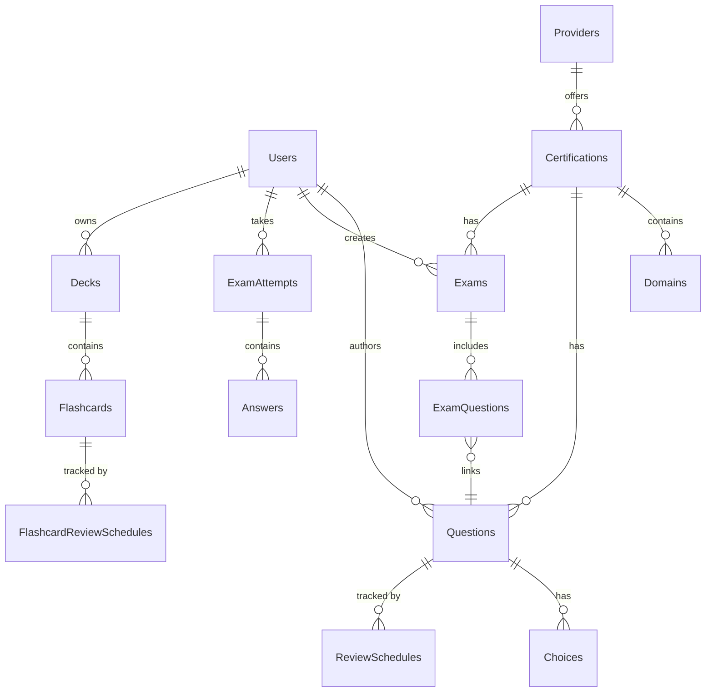

# 02 - Data Model

The Brain Gym platform uses **PostgreSQL** configured via the **Prisma ORM**. The data model supports diverse domains, including core entities, gamification, flashcards, AI features, and user hierarchies.

## 1. High-Level Entity Relationship Diagram

## 2. Core Domains 

### 2.1 Identity & Access Management
- **`User`**: Represents all actors (Learners, Contributors, Reviewers, Admins). Handles authentication logic, RBAC (`role`), and overall account status (`status`).
- **`AuditLog`**: System compliance tracking for administrative actions.

### 2.2 Content Taxonomy
- **`Provider`**: Exam vendors (e.g., AWS, Azure).
- **`Certification`**: Specific certifications (e.g., "AWS SAA").
- **`Domain`**: Topic weighting / breakdown inside a Certification.
- **`Tag` / `QuestionTag`**: Cross-cutting topic categorizations.

### 2.3 The Question Bank
- **`Question`**: The core learning primitive. Supports distinct `QuestionType` (Single / Multiple) and `Difficulty`. Tracks performance statistics (`correctCount`, `attemptCount`).
- **`Choice`**: Specific answers associated with a `Question`.
- **`Comment` & `Vote`**: Community verification, discussion, and quality control pipelines.
- **`Report`**: Mechanisms to flag outdated or incorrect questions.

### 2.4 Simulation Engine
- **`Exam`**: A collection of questions that forms a simulation instance. Can be `PUBLIC` or `PRIVATE`. Tracks `TimerMode`.
- **`ExamAttempt`**: Instances of a User taking an Exam. Records `score`, `timeSpent`, and dynamic domain breakdowns.
- **`Answer`**: Detailed recording of User selections within an Attempt. Tracks mistakes (`MistakeType`).

### 2.5 Training & Spaced Repetition (SRS)
- **`Deck` -> `Flashcard`**: Custom user-created flashcards or auto-derived cards.
- **`ReviewSchedule` & `FlashcardReviewSchedule`**: SM-2 spaced repetition markers (`interval`, `easeFactor`, `nextReviewDate`) to drive daily study loops.
- **`CapturedWord`**: Mid-exam learning captures sent to a user queue.

### 2.6 AI Systems
- **`UserLlmConfig`**: Stores user-provided credentials for BYOK (Bring Your Own Key) LLM usage.
- **`SourceMaterial` & `SourceChunk`**: Vector or text representations of uploaded PDFs/URLs for RAG pipeline.
- **`QuestionGenerationJob`**: Background jobs tracking the status of AI-generated questions.

## 3. Key Prisma Patterns utilized
- **Cascading Deletes**: Aggressively used to clean up orphaned data (e.g. dropping a `Question` cascades to its `Choices`).
- **Enums**: Used strictly for configuration (`Role`, `MistakeType`, `TimerMode`) natively at the DB level.
- **JSON Fields**: Configurable schemas stored inline where relations add unnecessary weight (e.g., `Exam.difficultyDist`, `Badge.criteria`).
