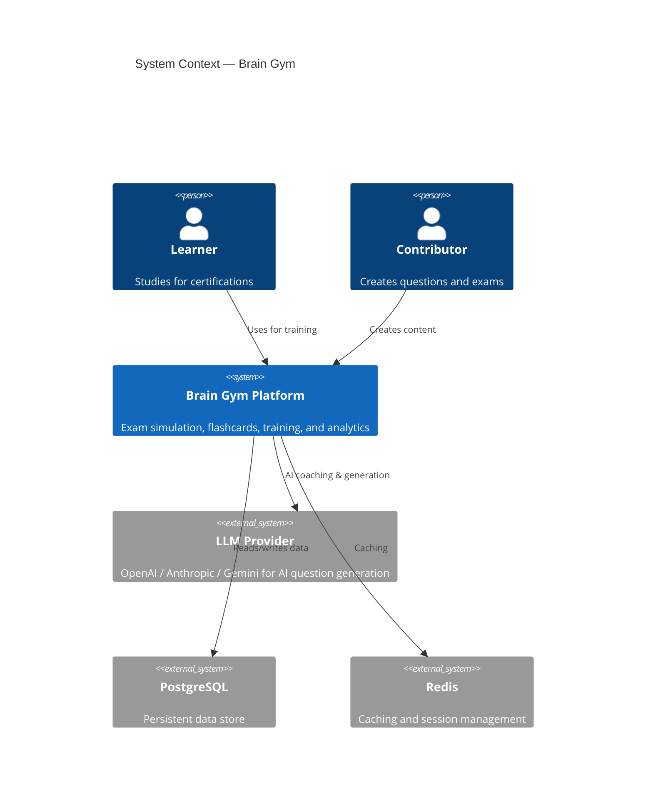
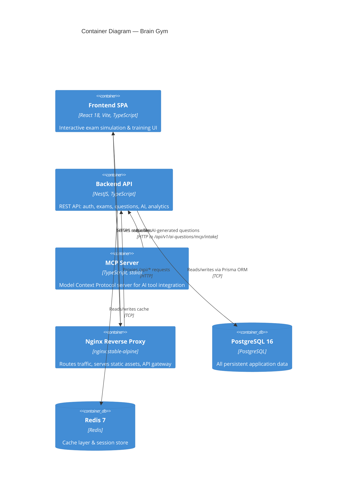
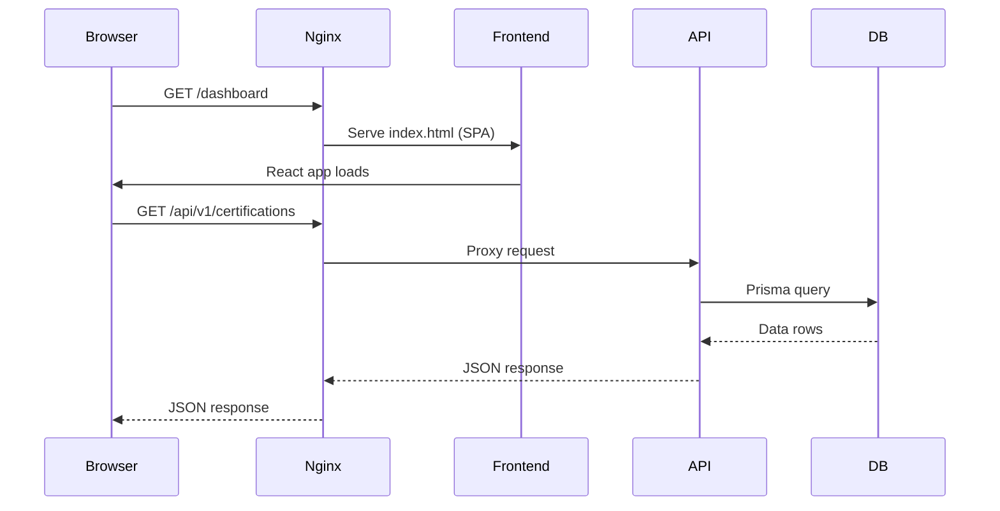
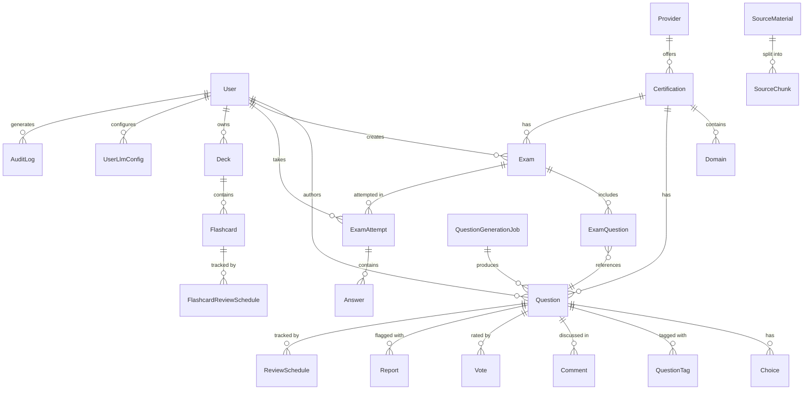
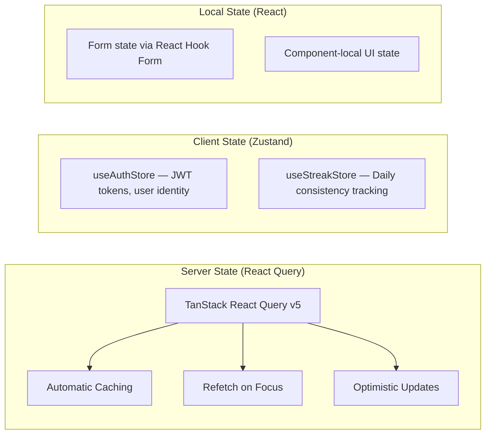
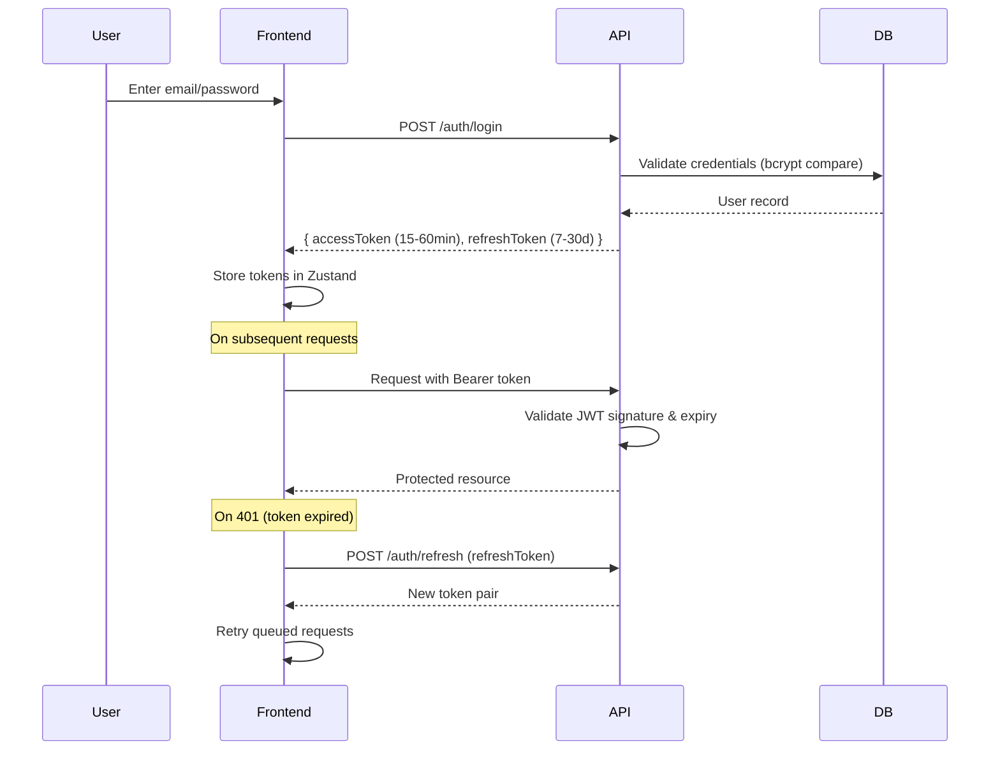
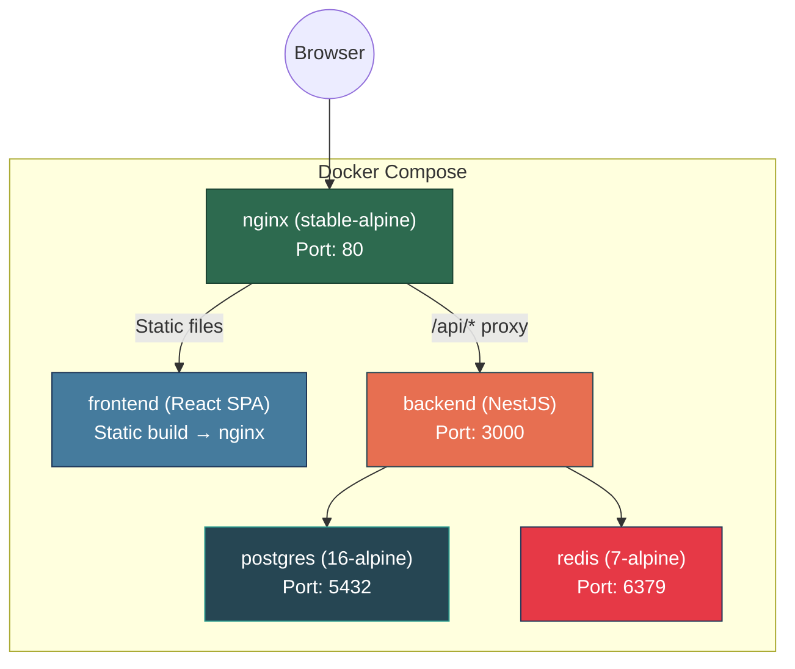

# Brain Gym — Basic Design Document

> **Version:** 1.0  
> **Date:** April 3, 2026  
> **Status:** Living Document

---

## Table of Contents

1. [Product Overview](#1-product-overview)
2. [System Architecture](#2-system-architecture)
3. [Technology Stack](#3-technology-stack)
4. [Data Model](#4-data-model)
5. [API Design](#5-api-design)
6. [Frontend Architecture](#6-frontend-architecture)
7. [Security & Authentication](#7-security--authentication)
8. [Deployment & Infrastructure](#8-deployment--infrastructure)
9. [Feature Summary](#9-feature-summary)
10. [Non-Functional Requirements](#10-non-functional-requirements)
11. [Future Roadmap](#11-future-roadmap)

---

## 1. Product Overview

### 1.1 Vision

Brain Gym is a **community-driven certification exam preparation platform** designed as a high-performance training system — not just a question bank. The platform helps learners train memory, refine reasoning, and build mental stamina for high-stakes certifications (AWS, Azure, GCP, etc.).

### 1.2 Core Pillars

| Pillar | Purpose |
| :--- | :--- |
| **Knowledge** | High-quality, community-curated, and AI-enhanced question banks |
| **Stamina** | Realistic, high-pressure exam simulation to fight "exam fatigue" |
| **Strategy** | Teaching the vendor mindset, trap elimination, and time management |

### 1.3 Target Personas

| Persona | Motivation |
| :--- | :--- |
| **Learner** | Passing the exam on the first try with minimal wasted study |
| **Contributor** | Building a reputation, helping the community, staying sharp |
| **Reviewer** | Ensuring accuracy, depth, and pedagogical quality |
| **Squad Lead** | Leading a group of learners toward a shared certification goal |

### 1.4 Three Sub-Systems

1. **Question Bank System** — Curated, version-controlled, AI-audited question repository
2. **Simulation Engine** — Zero-distraction exam environment with exact mechanics (timer, mark-for-review, domain breakdown)
3. **Analytics & Intelligence** — SM-2 spaced repetition engine, AI coaching, and actionable study plans

---

## 2. System Architecture

### 2.1 High-Level Context (C4 Level 1)



### 2.2 Container Architecture (C4 Level 2)



### 2.3 Request Flow



---

## 3. Technology Stack

### 3.1 Frontend

| Layer | Technology |
| :--- | :--- |
| Framework | React 18 + Vite 5 |
| Language | TypeScript 5 |
| Routing | React Router v6 |
| Server State | TanStack React Query v5 |
| Client State | Zustand v5 |
| UI Components | shadcn/ui (Radix UI primitives) |
| Styling | Tailwind CSS 3 + PostCSS |
| Animations | Framer Motion |
| HTTP Client | Axios |
| Forms | React Hook Form + Zod validation |
| Charts | Recharts |
| Testing | Vitest + React Testing Library |

### 3.2 Backend

| Layer | Technology |
| :--- | :--- |
| Framework | NestJS 11 |
| Language | TypeScript 5 |
| ORM | Prisma 6 |
| Database | PostgreSQL 16 |
| Cache | Redis 7 |
| Auth | Passport.js + JWT (`@nestjs/jwt`) |
| Validation | class-validator + class-transformer |
| API Docs | Swagger / OpenAPI (`@nestjs/swagger`) |
| Rate Limiting | `@nestjs/throttler` (60 req/min default) |
| PDF Parsing | pdf-parse (for source materials) |
| Encryption | bcryptjs (passwords), custom AES (LLM keys) |
| MCP | `@modelcontextprotocol/sdk` |
| Testing | Jest + Supertest |

### 3.3 Infrastructure

| Layer | Technology |
| :--- | :--- |
| Containerization | Docker + Docker Compose |
| Reverse Proxy | Nginx (stable-alpine) |
| Package Managers | npm, bun |
| CI/CD | GitHub Actions |

---

## 4. Data Model

The persistent layer uses **PostgreSQL** managed via **Prisma ORM**. The schema defines **25 models** across 6 data domains, with **16 enums** for type safety.

### 4.1 Entity Relationship Overview



### 4.2 Data Domains

#### Domain 1: Identity & Access Management
- **`User`** — All actors (Learner, Contributor, Reviewer, Admin). Stores role (`UserRole`), status (`UserStatus`), points, and suspension info.
- **`AuditLog`** — Tracks administrative actions with metadata, IP, and timestamps.

#### Domain 2: Content Taxonomy
- **`Provider`** → **`Certification`** → **`Domain`** — Hierarchical vendor/cert/topic structure.
- **`Tag`** / **`QuestionTag`** — Cross-cutting topic categorization.

#### Domain 3: Question Bank
- **`Question`** — Core learning primitive. Supports `SINGLE`/`MULTIPLE` types, `EASY`/`MEDIUM`/`HARD` difficulty, status workflow (`DRAFT` → `PENDING` → `APPROVED`/`REJECTED`). Tracks `isScenario`, `isTrapQuestion`, `isAiGenerated`, performance stats.
- **`Choice`** — Answer options with label (A-D), content, correctness, and sort order.
- **`Comment`** — Threaded discussion (supports `parentId` for replies).
- **`Vote`** — Polymorphic voting on questions or comments.
- **`Report`** — Content flagging (reasons: `WRONG_ANSWER`, `OUTDATED`, `DUPLICATE`, `INAPPROPRIATE`).

#### Domain 4: Simulation Engine
- **`Exam`** — Configurable exam templates. Supports `PUBLIC`/`PRIVATE`/`LINK` visibility, `STRICT`/`ACCELERATED`/`RELAXED` timer modes, adaptive difficulty, and share codes.
- **`ExamAttempt`** — Individual user exam sessions. Records score, time, domain-level breakdowns, status (`IN_PROGRESS`/`SUBMITTED`/`ABANDONED`).
- **`Answer`** — Per-question response recording. Tracks selected choices, correctness, time spent, mark-for-review flag, and mistake type (`CONCEPT`/`CARELESS`/`TRAP`/`TIME_PRESSURE`).

#### Domain 5: Training & Spaced Repetition
- **`Deck`** → **`Flashcard`** — User-created flashcard decks with optional certification binding.
- **`ReviewSchedule`** / **`FlashcardReviewSchedule`** — SM-2 algorithm parameters: `interval`, `easeFactor`, `repetitions`, `nextReviewDate`.
- **`CapturedWord`** — Mid-exam term capture for later study.

#### Domain 6: AI Systems
- **`UserLlmConfig`** — BYOK (Bring Your Own Key) LLM credentials. One config per provider per user (`OPENAI`/`ANTHROPIC`/`GEMINI`).
- **`SourceMaterial`** → **`SourceChunk`** — Uploaded documents (PDF/URL/Text) chunked for RAG-based question generation.
- **`QuestionGenerationJob`** — Background job tracking for AI question creation. Records token usage, quality scores, and status.

### 4.3 Key Schema Patterns

| Pattern | Usage |
| :--- | :--- |
| **UUID Primary Keys** | All models use `@default(uuid())` |
| **Cascading Deletes** | Orphan cleanup (e.g., Question → Choices, User → Decks) |
| **Soft Delete** | Questions use `deletedAt` field |
| **Database Enums** | 16 enums for strict type safety at the DB level |
| **JSON Fields** | Flexible schemas for `Exam.difficultyDist`, `Badge.criteria`, `ExamAttempt.domainScores` |
| **Composite Indexes** | Performance indexes on `[certificationId, status]`, `[action]`, `[targetType, targetId]` |
| **Snake_case Mapping** | Prisma `@map()` bridges TypeScript camelCase to PostgreSQL snake_case |

---

## 5. API Design

### 5.1 Conventions

| Aspect | Standard |
| :--- | :--- |
| Base Path | `/api/v1` |
| Auth | JWT Bearer token in `Authorization` header |
| Format | JSON exclusively |
| Validation | `class-validator` + `class-transformer` via NestJS `ValidationPipe` |
| Docs | Swagger UI at `/api/docs` (dev mode) |
| Rate Limit | 60 requests per minute (global `ThrottlerGuard`) |

### 5.2 HTTP Status Codes

| Code | Meaning |
| :--- | :--- |
| `200` | Success |
| `201` | Created |
| `400` | Validation error / malformed payload |
| `401` | Missing or expired JWT |
| `403` | Valid JWT, insufficient RBAC permissions |
| `404` | Resource not found |
| `429` | Rate limit exceeded |
| `500` | Internal server error |

### 5.3 Module Endpoints

| Module | Key Endpoints | Auth Required |
| :--- | :--- | :--- |
| **`auth/`** | `POST register`, `POST login`, `POST refresh` | No (public) |
| **`users/`** | Profile CRUD, role management | Yes |
| **`providers/`** | Vendor catalog (AWS, Azure, etc.) | Partial |
| **`certifications/`** | Cert catalog with domains | Partial |
| **`questions/`** | Full CRUD, voting, reporting | Varies by action |
| **`exams/`** | Create/list exam templates | Varies |
| **`attempts/`** | Start, submit answers, finish, get results | Yes |
| **`training/`** | SM-2 spaced repetition review submissions | Yes |
| **`flashcards/`** | Deck & card CRUD, review scheduling | Yes |
| **`capture/`** | Mid-exam word capture queue | Yes |
| **`ai-question-bank/`** | LLM config, source upload, generation jobs | Yes |
| **`comments/`** | Threaded comments on questions | Yes |
| **`reports/`** | Content flagging | Yes |
| **`tags/`** | Tag management | Yes |
| **`analytics/`** | Performance data, domain breakdowns | Yes |
| **`gamification/`** | Badges, points, leaderboard | Partial |
| **`admin/`** | Platform admin operations | Yes (ADMIN) |
| **`audit/`** | Audit log queries | Yes (ADMIN) |

### 5.4 Backend Module Architecture

```mermaid
graph TD
    AppModule --> ConfigModule
    AppModule --> ThrottlerModule
    AppModule --> PrismaModule
    AppModule --> AuthModule
    AppModule --> UsersModule
    AppModule --> ProvidersModule
    AppModule --> CertificationsModule
    AppModule --> QuestionsModule
    AppModule --> ExamsModule
    AppModule --> AttemptsModule
    AppModule --> CommentsModule
    AppModule --> ReportsModule
    AppModule --> AnalyticsModule
    AppModule --> GamificationModule
    AppModule --> TagsModule
    AppModule --> TrainingModule
    AppModule --> FlashcardsModule
    AppModule --> CaptureModule
    AppModule --> AiQuestionBankModule
    AppModule --> AdminModule
    AppModule --> AuditModule

    AuthModule -.-> PrismaModule
    QuestionsModule -.-> PrismaModule
    ExamsModule -.-> PrismaModule

    style AppModule fill:#1a1a2e,stroke:#16213e,color:#e94560
    style PrismaModule fill:#0f3460,stroke:#16213e,color:#e2e2e2
    style AuthModule fill:#533483,stroke:#16213e,color:#e2e2e2
```



---

## 6. Frontend Architecture

### 6.1 Directory Structure

```
src/
├── components/          # Reusable UI elements
│   ├── ui/              # shadcn/ui primitives (Button, Input, Dialog, etc.)
│   ├── exam/            # Simulation engine (Timer, QuestionNavigator)
│   ├── questions/       # Question cards, option selectors
│   ├── dashboard/       # Dashboard widgets
│   ├── training/        # Spaced repetition components
│   └── ai-questions/    # AI generation UI
├── pages/               # 20+ routable top-level views
│   ├── admin/           # Admin panel
│   └── org/             # Organization management
├── hooks/               # Custom hooks (useTimer, useDebounce, useTextSelection, etc.)
├── services/            # Axios API abstraction layer (15 service files)
├── stores/              # Zustand stores (auth.store, streak.store)
├── types/               # TypeScript interfaces
├── utils/               # Pure helper functions
├── lib/                 # Utility configs (shadcn utils)
├── data/                # Static data/constants
├── App.tsx              # Root: Router, Providers, AnimatePresence
└── main.tsx             # React DOM mount point
```

### 6.2 State Management Strategy



### 6.3 Routing Map

All routes use lazy-loaded pages via `React.lazy()` with animated page transitions (`Framer Motion`).

| Route | Page | Protected |
| :--- | :--- | :--- |
| `/` | Landing / Home | No |
| `/auth` | Login / Register | No |
| `/questions` | Question Browser | No |
| `/questions/new` | Question Creator | No |
| `/questions/:id` | Question Detail | No |
| `/trap-questions` | Trap Question Library | No |
| `/exams` | Exam Library | No |
| `/exams/create` | Exam Builder | ✅ |
| `/exams/share/:shareCode` | Exam Share | No |
| `/exam/:certId` | Exam Simulation | ✅ |
| `/study/:certId` | Study Mode | No |
| `/exam-results` | Result Analysis | No |
| `/dashboard` | Personal Dashboard | No |
| `/training` | Training Hub | No |
| `/decks` | Flashcard Decks | ✅ |
| `/decks/:deckId` | Deck Detail | ✅ |
| `/decks/:deckId/study` | Flashcard Study | ✅ |
| `/leaderboard` | Leaderboard | No |
| `/ai-generate` | AI Question Generator | ✅ |
| `/admin` | Admin Panel | ✅ |
| `/org/*` | Organization Pages | ✅ |

### 6.4 Services Layer

The `src/services/api.ts` Axios instance centralizes:
- **Base URL** configuration via `VITE_API_BASE_URL`
- **JWT injection** via request interceptors
- **401 Auto-refresh** — intercepts unauthorized responses, rotates tokens via `/auth/refresh`, and retries the original request transparently

15 domain-specific service files map 1:1 to backend modules.

### 6.5 Design Language

| Aspect | Choice |
| :--- | :--- |
| Theme | Dark mode with glassmorphism effects |
| Accent | Glowing cyan highlights (`border-primary`, `bg-background`) |
| Typography | Monospaced for exam-adjacent content |
| Animations | Smooth page transitions via `AnimatePresence` |
| Mobile | Bottom tab bar navigation, responsive layouts |

---

## 7. Security & Authentication

### 7.1 Authentication Flow



### 7.2 Role-Based Access Control (RBAC)

| Role | Permissions |
| :--- | :--- |
| **LEARNER** (default) | Consume public exams, track attempts, own flashcard decks, comment, vote |
| **CONTRIBUTOR** | + Submit new questions, build public exams (land in `PENDING` status) |
| **REVIEWER** | + Approve/reject pending content, modify community metadata |
| **ADMIN** | Full platform control: taxonomy management, user bans, audit log access |

Implementation: `@UseGuards(JwtAuthGuard, RolesGuard)` + `@Roles()` metadata decorators on NestJS endpoints.

### 7.3 Threat Mitigations

| Threat | Mitigation |
| :--- | :--- |
| Password Theft | bcrypt hashing with strict rounds |
| SQL Injection | Prisma ORM parameterized queries |
| Cross-Site Forgery | CORS whitelist via `CORS_ORIGINS` env |
| Token Theft | Short-lived access tokens, refresh rotation |
| DDoS / Spam | `@nestjs/throttler` at 60 req/min globally |
| Sensitive Key Exposure | LLM API keys encrypted at rest in DB |

---

## 8. Deployment & Infrastructure

### 8.1 Docker Compose Topology



### 8.2 Container Details

| Container | Base Image | Purpose |
| :--- | :--- | :--- |
| `braingym-nginx` | `nginx:stable-alpine` | Reverse proxy + API gateway + SPA routing fallback |
| `braingym-frontend` | Multi-stage (node → `nginx:alpine`) | Builds React/Vite → serves static assets |
| `braingym-backend` | `node` | NestJS API server; runs Prisma migrations on boot |
| `braingym-postgres` | `postgres:16-alpine` | Primary data store with health checks |
| `braingym-redis` | `redis:7-alpine` | Cache layer with health checks |

### 8.3 Environment Configuration

| Scope | File | Key Variables |
| :--- | :--- | :--- |
| Frontend | `.env` / `.env.example` | `VITE_API_BASE_URL` |
| Backend | `backend/.env` / `.env.example` | `DATABASE_URL`, `JWT_SECRET`, `JWT_REFRESH_SECRET`, `LLM_KEY_ENCRYPTION_SECRET`, `REDIS_HOST`, `REDIS_PORT` |
| Docker | `docker-compose.yml` | `POSTGRES_DB`, `POSTGRES_USER`, `POSTGRES_PASSWORD`, `NGINX_PORT`, `NODE_ENV` |

### 8.4 Nginx Configuration

1. **SPA Routing** — All unmapped paths fallback to `index.html`
2. **API Gateway** — Routes `/api/*` are reverse-proxied to the backend container, eliminating CORS configuration in production
3. **Unified Domain** — Single origin for both frontend and API

---

## 9. Feature Summary

### 9.1 Implemented Features

| Feature Area | Capabilities |
| :--- | :--- |
| **Question Bank** | CRUD, community voting/reporting, threaded comments, trap question flagging, status workflow (Draft → Pending → Approved), tagging |
| **Exam Simulation** | Configurable templates, 3 timer modes (Strict/Accelerated/Relaxed), mark-for-review, mid-exam word capture, domain score breakdowns |
| **Flashcards** | Deck management, manual + exam-derived cards, starred cards, SM-2 review scheduling with mastery levels |
| **Spaced Repetition** | SM-2 algorithm for both questions and flashcards with interval/easeFactor tracking |
| **AI Question Gen** | BYOK multi-provider (OpenAI/Anthropic/Gemini), source material upload (PDF/URL/Text), chunked RAG pipeline, background generation jobs, quality scoring |
| **MCP Integration** | Standalone MCP server for external AI tools to push bulk questions |
| **Gamification** | Points system, badges with configurable criteria, leaderboard |
| **Analytics** | Personal dashboard, attempt history, domain-level performance breakdowns |
| **Organizations** | Org creation, member management, org settings, team analytics |
| **Admin Panel** | Taxonomy management (providers, certifications, domains), user moderation (suspend/ban), content moderation, audit logging |
| **Study Mode** | Certification-specific study sessions |

### 9.2 MCP Server Integration

The Brain Gym MCP Server (`backend/src/mcp-server.ts`) enables external AI tools (Claude Desktop, NotebookLM, etc.) to push bulk-generated questions via the Model Context Protocol:

```
External AI Tool → MCP Server (stdio) → POST /api/v1/ai-questions/mcp/intake → Quality Gate → PostgreSQL
```

---

## 10. Non-Functional Requirements

| Requirement | Target |
| :--- | :--- |
| **Performance** | API responses < 200ms for standard queries |
| **Rate Limiting** | 60 requests/minute per client (global) |
| **Code Splitting** | All pages lazy-loaded via `React.lazy()` |
| **Type Safety** | Full TypeScript coverage (frontend & backend) |
| **Data Integrity** | 16 DB-level enums, cascading deletes, soft-delete for questions |
| **Testing** | Vitest (frontend), Jest + Supertest (backend) |
| **Error Handling** | Global error boundary (frontend), NestJS exception filters (backend) |
| **Mobile Support** | Responsive design with bottom tab bar navigation |

---

## 11. Future Roadmap

| Phase | Focus |
| :--- | :--- |
| **V1: Foundation** ✅ | MCQ bank, basic analytics, core simulation, flashcards |
| **V2: Intelligence** | Adaptive weakness training, AI explanations, exam readiness score |
| **V3: Community** | Training Squads, peer review challenges, expert-led sessions |
| **V4: Ecosystem** | Cross-certification knowledge graph, lab integrations, institutional dashboards |

### Planned Innovations

- **Cross-Certification Knowledge Graph** — Visualize skill overlap between vendors
- **Dynamic Difficulty Scaling** — Modify distractors to prevent rote memorization
- **Burnout Detection** — AI monitors response time variance for mental fatigue signals
- **Anxiety Management** — Micro-modules for exam day preparation
- **Trap Question Library** — Dedicated module for questions with two "technically correct" answers

---

> *"The goal is not to pass once, but to master the domain forever."*
