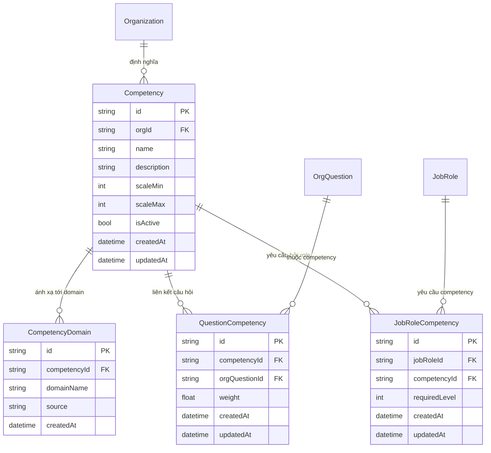
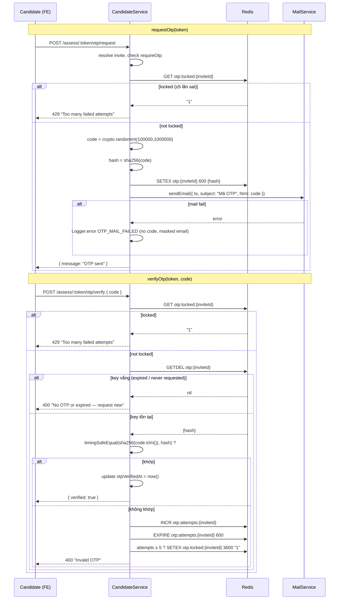

# Sprint 0 — Foundation: Basic Design

> **Phiên bản:** 1.0
> **Ngày:** 14/06/2026
> **Trạng thái:** Draft (chờ review từ Architect / Security / Database)
> **Sprint:** Sprint 0 — Foundation / De-risking cho sáng kiến Enterprise Organization
> **ADR liên quan:** [ADR-028 — Competency Scoring Algorithm](../adr/028-competency-scoring.md)

---

## Mục lục

1. [Tổng quan & Mục tiêu](#1-tổng-quan--mục-tiêu)
2. [Phạm vi & Truy vết FR-1..FR-6](#2-phạm-vi--truy-vết-fr-1fr-6)
3. [Mô hình dữ liệu (FR-1)](#3-mô-hình-dữ-liệu-fr-1)
4. [Kiến trúc module `competency` (FR-4)](#4-kiến-trúc-module-competency-fr-4)
5. [Thuật toán suy luận competency level (FR-2)](#5-thuật-toán-suy-luận-competency-level-fr-2)
6. [Thiết kế OTP → Redis + gửi email (FR-3)](#6-thiết-kế-otp--redis--gửi-email-fr-3)
7. [`parseCandidateCsv` & contract-check `getResults` (FR-5)](#7-parsecandidatecsv--contract-check-getresults-fr-5)
8. [Project hygiene (FR-6)](#8-project-hygiene-fr-6)
9. [Bảo mật & Kiểm thử](#9-bảo-mật--kiểm-thử)
10. [Feature-flag / Rollout](#10-feature-flag--rollout)
11. [Open questions](#11-open-questions)

---

## 1. Tổng quan & Mục tiêu

Sprint 0 là sprint **nền tảng / de-risking** cho sáng kiến **Enterprise Organization** — gồm hai năng lực lõi:

- **Employee Competency Assessment** — đánh giá năng lực nhân viên hiện hữu theo khung năng lực (competency) của tổ chức.
- **Entry-selection Hiring** — sàng lọc ứng viên đầu vào dựa trên kết quả assessment, xếp hạng và quyết định tuyển dụng.

Mục tiêu của Sprint 0 **không phải** là giao tính năng người dùng cuối mà là **gỡ rủi ro kỹ thuật** và **dựng khung** để các sprint sau xây tính năng trên nền ổn định:

1. Đặt **mô hình dữ liệu competency** (additive, zero-downtime) làm xương sống cho cả assessment lẫn hiring.
2. Chốt **thuật toán suy luận competency level** (xem ADR-003) ở dạng pure function, có unit test, không phụ thuộc tầng I/O.
3. Đưa **OTP store** từ in-memory `Map` (chỉ đúng trên 1 pod) sang **Redis** (đúng trên multi-pod) và nối **gửi OTP qua email thật** (hiện đang là stub `console.log`).
4. **Scaffold module `competency`** ở cả backend (NestJS) và frontend (service + route + sidebar) theo đúng pattern hiện có, để các sprint sau "điền" logic mà không phải dựng lại khung.
5. Tách **util parse CSV ứng viên** dùng chung và **kiểm tra contract** của `getResults` (ranking) để tránh nợ kỹ thuật khi mở rộng.
6. **Project hygiene** — chuẩn hóa quy trình (CI, migration, env validation) để các enabler trên không tạo drift.

### 1.1 Nguyên tắc thiết kế xuyên suốt

| Nguyên tắc                   | Áp dụng                                                                                                       |
| :--------------------------- | :------------------------------------------------------------------------------------------------------------ |
| **Additive-only schema**     | 4 model mới, không sửa/không drop cột model cũ → migration zero-downtime                                      |
| **Mirror existing patterns** | Module `competency` sao chép cấu trúc `org-questions/`; guard `OrgRoleGuard` + decorator `@OrgRoles`          |
| **Pure core, thin shell**    | Logic chấm điểm là pure function thuần (test được, không I/O); service chỉ điều phối                          |
| **Reuse stored data**        | v0 tái dùng `domainScores` đã lưu thay vì re-fetch raw answers (xem ADR-003)                                  |
| **Multi-pod correctness**    | Mọi state runtime (OTP) phải nằm ở Redis, không nằm trong process memory                                      |
| **TS loose**                 | Tôn trọng `noImplicitAny: false` / `strictNullChecks: false` của repo — không thêm strictness không cần thiết |

---

## 2. Phạm vi & Truy vết FR-1..FR-6

Sprint 0 gồm **6 enabler issue**, ánh xạ 1:1 với FR-1..FR-6 (SRS đang viết song song dùng cùng mapping):

| FR       | Issue       | Tên enabler                      | Deliverable chính                                                                         | Mục                                                          |
| :------- | :---------- | :------------------------------- | :---------------------------------------------------------------------------------------- | :----------------------------------------------------------- |
| **FR-1** | S0-1 (#123) | Prisma data model                | 4 model + migration (Competency, CompetencyDomain, QuestionCompetency, JobRoleCompetency) | [§3](#3-mô-hình-dữ-liệu-fr-1)                                |
| **FR-2** | S0-2 (#124) | Scoring algorithm                | `inferCompetencyLevel()` pure function + unit tests                                       | [§5](#5-thuật-toán-suy-luận-competency-level-fr-2) + ADR-028 |
| **FR-3** | S0-3 (#125) | OTP → Redis + email              | Redis-backed OTP store; gửi OTP qua `MailService`; validate SMTP env lúc khởi động        | [§6](#6-thiết-kế-otp--redis--gửi-email-fr-3)                 |
| **FR-4** | S0-4 (#126) | Scaffold `competency` module     | BE module (controller/service/module/dto + guard) + FE service/route/sidebar              | [§4](#4-kiến-trúc-module-competency-fr-4)                    |
| **FR-5** | S0-5 (#127) | Shared CSV util + contract-check | `parseCandidateCsv` util; xác nhận contract `getResults` cho ranking                      | [§7](#7-parsecandidatecsv--contract-check-getresults-fr-5)   |
| **FR-6** | S0-6 (#128) | Project hygiene                  | Quy trình CI/migration/env validation                                                     | [§8](#8-project-hygiene-fr-6)                                |

**Ngoài phạm vi (out of scope) Sprint 0:** UI competency hoàn chỉnh, gán Competency↔Question qua UI, dashboard hiring, tích hợp ATS bên ngoài, tính toán confidence nâng cao. Các phần này nằm trên khung do Sprint 0 dựng.

---

## 3. Mô hình dữ liệu (FR-1)

### 3.1 ERD



**Vai trò từng model:**

- **`Competency`** — đơn vị năng lực do org định nghĩa (vd "Cloud Networking", "Secure Coding"). `scaleMin/scaleMax` (mặc định 1–5) cho phép từng org chọn thang riêng.
- **`CompetencyDomain`** — **cầu nối tới các key của `domainScores`** (so khớp **case-insensitive**). Đây là bảng then chốt cho thuật toán chấm điểm v0 (xem ADR-028 phương án B): một competency gom nhiều domain-name string. Trường `source` (`CompetencyDomainSource`) phân biệt hai namespace của `domainScores` key: `ORG_QUESTION_CATEGORY` (key từ `OrgQuestion.category` — `CandidateInvite.domainScores` dùng trong hiring workflow) và `PUBLIC_DOMAIN` (key từ `Domain.name` — `ExamAttempt.domainScores` dùng trong employee assessment workflow). Cùng tên domain có thể tồn tại ở cả hai namespace mà không xung đột nhờ unique constraint `(competencyId, source, domainName)`.
- **`QuestionCompetency`** — liên kết câu hỏi org (`OrgQuestion`) với competency, có `weight`. **Chưa dùng để chấm điểm ở v0**, giữ sẵn cho v1 (chấm chính xác theo từng câu hỏi).
- **`JobRoleCompetency`** — định nghĩa **ngưỡng năng lực yêu cầu** (`requiredLevel`) của một `JobRole` cho từng competency → dùng cho hiring (so sánh level đạt được vs level yêu cầu).

### 3.2 Prisma DDL (final)

> Thêm vào `backend/prisma/schema.prisma`. Quan hệ ngược (`competencies Competency[]` …) được thêm vào các model hiện hữu — đây là thay đổi **schema-only, không đổi cột vật lý** nên an toàn.

```prisma
// Enum phân biệt namespace của domainScores keys:
// ORG_QUESTION_CATEGORY → keyed theo OrgQuestion.category (CandidateInvite.domainScores, hiring workflow)
// PUBLIC_DOMAIN         → keyed theo Domain.name (ExamAttempt.domainScores, employee assessment workflow)
enum CompetencyDomainSource {
  ORG_QUESTION_CATEGORY
  PUBLIC_DOMAIN
}

model Competency {
  id          String   @id @default(uuid())
  orgId       String   @map("org_id")
  name        String
  description String?
  scaleMin    Int      @default(1)  @map("scale_min")
  scaleMax    Int      @default(5)  @map("scale_max")
  isActive    Boolean  @default(true) @map("is_active")
  createdAt   DateTime @default(now()) @map("created_at")
  updatedAt   DateTime @updatedAt @map("updated_at")

  organization Organization         @relation(fields: [orgId], references: [id], onDelete: Cascade)
  domains      CompetencyDomain[]
  questions    QuestionCompetency[]
  jobRoles     JobRoleCompetency[]

  @@unique([orgId, name])
  @@index([orgId])
  @@map("competencies")
}

model CompetencyDomain {
  id           String                 @id @default(uuid())
  competencyId String                 @map("competency_id")
  domainName   String                 @map("domain_name") @db.VarChar(200)
  source       CompetencyDomainSource @default(ORG_QUESTION_CATEGORY) @map("source")
  createdAt    DateTime               @default(now()) @map("created_at")

  competency Competency @relation(fields: [competencyId], references: [id], onDelete: Cascade)

  // Unique per (competencyId, source, domainName) — cho phép cùng tên domain tồn tại ở cả hai namespace
  @@unique([competencyId, source, domainName])
  @@index([competencyId])
  @@map("competency_domains")
}

model QuestionCompetency {
  id            String   @id @default(uuid())
  competencyId  String   @map("competency_id")
  orgQuestionId String   @map("org_question_id")
  weight        Float    @default(1)
  createdAt     DateTime @default(now()) @map("created_at")
  updatedAt     DateTime @updatedAt @map("updated_at")

  competency  Competency  @relation(fields: [competencyId], references: [id], onDelete: Cascade)
  orgQuestion OrgQuestion @relation(fields: [orgQuestionId], references: [id], onDelete: Cascade)

  @@unique([competencyId, orgQuestionId])
  @@index([orgQuestionId])
  @@map("question_competencies")
}

model JobRoleCompetency {
  id            String   @id @default(uuid())
  jobRoleId     String   @map("job_role_id")
  competencyId  String   @map("competency_id")
  requiredLevel Int      @map("required_level")
  createdAt     DateTime @default(now()) @map("created_at")
  updatedAt     DateTime @updatedAt @map("updated_at")

  jobRole    JobRole    @relation(fields: [jobRoleId], references: [id], onDelete: Cascade)
  // Restrict: không cho xóa Competency khi còn JobRole đang tham chiếu; dùng isActive=false để retire
  competency Competency @relation(fields: [competencyId], references: [id], onDelete: Restrict)

  @@unique([jobRoleId, competencyId])
  @@index([competencyId])
  @@map("job_role_competencies")
}
```

**Quan hệ ngược cần thêm vào model hiện hữu (chỉ tồn tại ở tầng Prisma, không phát sinh DDL):**

```prisma
// model Organization  (L806)
competencies Competency[]

// model OrgQuestion   (L908)
competencyLinks QuestionCompetency[]

// model JobRole       (L1031)
competencyReqs JobRoleCompetency[]
```

### 3.3 Chiến lược migration (additive, zero-downtime)

| Khía cạnh          | Quyết định                                                                                                                                                                                                                                      |
| :----------------- | :---------------------------------------------------------------------------------------------------------------------------------------------------------------------------------------------------------------------------------------------- |
| **Loại migration** | **Additive-only** — chỉ `CREATE TABLE` + `CREATE INDEX`. Không `ALTER`/`DROP` cột của bảng cũ → không khóa bảng nóng, không downtime.                                                                                                           |
| **Thứ tự deploy**  | (1) chạy migration tạo bảng mới → (2) deploy code đọc/ghi bảng mới. Vì code cũ không tham chiếu bảng mới nên hai bước **độc lập, có thể rollback từng bước**.                                                                                   |
| **Cascade rules**  | `onDelete: Cascade` ở mọi FK: xóa Organization → dọn Competency → dọn CompetencyDomain/QuestionCompetency/JobRoleCompetency; xóa OrgQuestion → dọn QuestionCompetency; xóa JobRole → dọn JobRoleCompetency. Không để dữ liệu mồ côi.            |
| **Index**          | `@@index([orgId])` (list theo org), `@@index([competencyId])` (join từ competency), `@@index([orgQuestionId])` (impact khi xóa question). Mọi `@@unique` cũng tạo index ngầm phục vụ idempotent upsert.                                         |
| **Backfill**       | **Không cần** — bảng mới rỗng, không có dữ liệu lịch sử để di trú.                                                                                                                                                                              |
| **Lệnh**           | `npx prisma migrate dev --name s0_competency_models` (dev) → migration SQL được commit và chạy ở môi trường cao hơn qua `prisma migrate deploy`. **Bắt buộc** chạy `npm install` (postinstall → `prisma generate`) trên worktree mới (US-1111). |

---

## 4. Kiến trúc module `competency` (FR-4)

### 4.1 Cây file backend (mirror `org-questions/`)

```
backend/src/competency/
├── competency.module.ts
├── competency.controller.ts
├── competency.service.ts
└── dto/
    ├── create-competency.dto.ts
    ├── update-competency.dto.ts
    ├── list-competencies.dto.ts
    ├── map-domain.dto.ts                # gắn domainName vào competency
    └── set-job-role-requirement.dto.ts
```

Module đăng ký trong `app.module.ts` (`AppModule → CompetencyModule`), import `PrismaModule`. Controller dùng `@UseGuards(OrgRoleGuard)` ở cấp class (giống `OrgQuestionsController`), `@SkipThrottle()`, `@ApiTags('competency')`, `@ApiBearerAuth()`.

> **Lưu ý đường dẫn:** Đề bài mô tả endpoint dưới `/orgs/:slug/competencies`. Các controller org hiện hữu (`org-questions`, `organizations`) dùng base **`organizations/:orgId/...`** với `OrgRoleGuard` đã resolve **cả `:orgId` lẫn `:slug`** (xem guard: `OR: [{ orgId }, { organization: { slug: orgId } }]`). Để **không tạo pattern thứ hai**, scaffold dùng base `organizations/:orgId/competencies` cho nhất quán; tham số `:orgId` chấp nhận cả slug. (Xem [Open questions](#11-open-questions) #1.)

### 4.2 Bảng REST endpoints

Base: `organizations/:orgId/competencies` (`:orgId` = id **hoặc** slug). Tất cả yêu cầu JWT + là member của org.

| Method   | Path (dưới base) | Role guard (`@OrgRoles`) | Mục đích (Sprint 0)                            |
| :------- | :--------------- | :----------------------- | :--------------------------------------------- |
| `GET`    | `/`              | member (any)             | List competency của org — scaffold trả `[]`    |
| `GET`    | `/:competencyId` | member (any)             | Chi tiết 1 competency — scaffold trả `501`     |
| `POST`   | `/`              | `OWNER, ADMIN, MANAGER`  | Tạo competency — scaffold trả `501` (xem §10)  |
| `PATCH`  | `/:competencyId` | `OWNER, ADMIN, MANAGER`  | Sửa metadata / `isActive` — scaffold trả `501` |
| `DELETE` | `/:competencyId` | `OWNER, ADMIN`           | Xóa (cascade) — scaffold trả `501`             |

> **Defer (Sprint 1+):** Sub-resource endpoints `/:competencyId/domains` (POST/DELETE) và `/:competencyId/job-roles/:jobRoleId` (PUT) **không mount trong Sprint 0** khi `FEATURE_COMPETENCY=false`. Thêm sau khi UI và business logic hoàn thiện ở sprint sau. Khi `FEATURE_COMPETENCY=true` (staging), chỉ 5 endpoint trên được mount.

> **Read permissions:** `GET` endpoints trả dữ liệu lọc theo `isActive = true` cho RECRUITER/MEMBER; OWNER/ADMIN/MANAGER thấy cả inactive. `JwtAuthGuard` chạy **trước** `OrgRoleGuard` — không có endpoint nào bypass JWT.

> Phân quyền theo `OrgRole` (OWNER/ADMIN/MANAGER/RECRUITER/MEMBER). RECRUITER/MEMBER chỉ đọc; thao tác cấu hình khung năng lực dành cho MANAGER trở lên. Đây là baseline — sprint sau có thể tinh chỉnh.

### 4.3 DTO (class-validator)

```ts
// create-competency.dto.ts
export class CreateCompetencyDto {
  @IsString()
  @IsNotEmpty()
  @MaxLength(120)
  name: string;

  @IsString()
  @IsOptional()
  @MaxLength(1000)
  description?: string;

  @IsInt()
  @Min(1)
  @IsOptional()
  scaleMin?: number; // default 1

  @IsInt()
  @Max(10)
  @IsOptional()
  scaleMax?: number; // default 5

  @IsArray()
  @IsString({ each: true })
  @IsOptional()
  domainNames?: string[]; // tiện ích: map domain ngay khi tạo
}

// map-domain.dto.ts
export class MapDomainDto {
  @IsString()
  @IsNotEmpty()
  @MaxLength(200)
  domainName: string;
}

// set-job-role-requirement.dto.ts
export class SetJobRoleRequirementDto {
  @IsInt()
  @Min(1)
  requiredLevel: number; // validate ≤ scaleMax ở service layer
}
```

### 4.4 Frontend

- **`src/services/competency.ts`** — service Axios mirror các `src/services/*.ts` khác; dùng instance chung trong `api.ts` (JWT injection + 401 refresh sẵn có). Hàm: `listCompetencies(orgId)`, `getCompetency(orgId, id)`, `createCompetency`, `updateCompetency`, `deleteCompetency`, `mapDomain`, `setJobRoleRequirement`. Tiêu thụ qua TanStack Query (`useQuery`/`useMutation`, `queryKey: ['competencies', orgId]`).
- **Route** — thêm trang lazy-loaded dưới `/org/:slug/competencies` trong `App.tsx`, bọc `<ProtectedRoute>` + `<PageTransition>`.
- **`src/components/org/OrgSidebar.tsx`** — thêm mục "Competencies" (ẩn sau feature-flag, xem §10).

---

## 5. Thuật toán suy luận competency level (FR-2)

Chi tiết quyết định và đặc tả hàm thuần nằm trong **[ADR-028 — Competency Scoring](../adr/028-competency-scoring.md)**. Tóm tắt cho basic design:

- **Vị trí:** pure function trong `backend/src/competency/scoring/infer-competency-level.ts` — **không phụ thuộc Prisma/HTTP**, nhận tham số đã chuẩn bị sẵn, dễ unit test.
- **Chữ ký (canonical — xem ADR-028):**
  ```ts
  inferCompetencyLevel(
    domainScores: Record<string, { correct: number; total: number }>,
    mappedDomains: string[],
    options: { scaleMin: number; scaleMax: number; thresholds: Threshold[] },
  ): { level: number; percentage: number; confidence: 'LOW' | 'MEDIUM' | 'HIGH'; sampleSize: number; matchedDomains: string[] };
  ```
- **Cách tính (v0 — phương án B):** `percentage = Σcorrect / Σtotal` trên các domain (case-insensitive) thuộc `mappedDomains`, rồi bucket vào level theo bảng ngưỡng. Không re-fetch raw answers.
- **Nguồn `domainScores`:** đã được tính sẵn khi nộp bài (`candidate.service.ts submitAttempt` L197–223, `org-analytics getSkillGaps` L179), shape `Record<string,{correct,total}>` keyed theo tên domain/category.

Service layer chịu trách nhiệm: lấy `CompetencyDomain.domainName[]` của competency → đọc `CandidateInvite.domainScores` (hoặc `ExamAttempt.domainScores`) → gọi pure function → trả kết quả. Toàn bộ logic chấm điểm "thật" được kết nối ở sprint sau; Sprint 0 chỉ giao **pure function + test**.

---

## 6. Thiết kế OTP → Redis + gửi email (FR-3)

### 6.1 Vấn đề hiện tại

`candidate.service.ts:19` lưu OTP trong **in-memory `Map`** (`otpStore`). Trên môi trường multi-pod (production scale-out), OTP set ở pod A không đọc được ở pod B → verify fail ngẫu nhiên. Ngoài ra `requestOtp` **chưa gửi email thật** (chỉ `console.log` masked email, L71–74 là TODO).

### 6.2 Redis key scheme

| Thuộc tính               | Giá trị                                                                                                                                   |
| :----------------------- | :---------------------------------------------------------------------------------------------------------------------------------------- |
| **Key OTP**              | `otp:{inviteId}` → sha256 hash của code (không lưu code thô)                                                                              |
| **Lệnh ghi OTP**         | `SETEX otp:{inviteId} 600 {hash}` (TTL = 600s = 10 phút)                                                                                  |
| **Lệnh verify (atomic)** | `GETDEL otp:{inviteId}` (Redis 7) — đọc và xóa nguyên tử; chống race condition GET+DEL; key vắng sau khi verify                           |
| **TTL OTP**              | Redis tự expire → loại bỏ logic `expiresAt` thủ công; vắng key ⇒ "chưa request hoặc đã hết hạn"                                           |
| **Key counter**          | `otp:attempts:{inviteId}` → số lần verify sai; `INCR` mỗi lần sai; `EXPIRE 600` sau mỗi lần ghi                                           |
| **Key lock**             | `otp:locked:{inviteId}` → `SETEX otp:locked:{inviteId} 3600 "1"` khi counter ≥ 5; `GET` để chặn verify/request mới; TTL 1 giờ             |
| **Fail-CLOSED Redis**    | Nếu Redis không thể kết nối → `requestOtp`/`verifyOtp` trả **503** (không fallback về in-memory); ghi log alert và trả lỗi rõ ràng cho FE |

### 6.3 Wiring Redis client provider

Repo **đã có ioredis** dùng trực tiếp ở `backend/src/mastery/mastery.service.ts` (`new Redis({ host: REDIS_HOST, port: REDIS_PORT })`) và qua BullMQ ở `queues.module.ts`. **Không cần thêm dependency.** Để tránh mỗi service tự `new Redis()` (rải rác config, nhiều kết nối), Sprint 0 chuẩn hóa:

- Tạo **`RedisModule` (@Global)** với provider `REDIS_CLIENT` export một instance `ioredis` duy nhất cấu hình từ `REDIS_HOST`, `REDIS_PORT`, **`REDIS_PASSWORD`** (bắt buộc có trong ConfigModule validation schema). Thiếu `REDIS_PASSWORD` trên môi trường production → fail-fast lúc bootstrap.
- `CandidateService` inject `REDIS_CLIENT` thay cho `Map`.
- (Cleanup theo sau — không bắt buộc trong Sprint 0): `mastery.service.ts` chuyển sang dùng provider chung. Ghi nhận như hygiene item (FR-6).

### 6.4 Sequence — request & verify



### 6.5 Gửi OTP qua MailService

- Dùng `MailService.sendEmail({ to, subject, html })` (đã có, `@Global MailModule`). Inject `MailService` vào `CandidateService`.
- Template HTML tối giản, hiển thị code lớn, có cảnh báo hết hạn 10 phút và "không chia sẻ code":
  ```html
  <h2>Mã xác thực của bạn</h2>
  <p>Mã OTP để bắt đầu bài đánh giá:</p>
  <p style="font-size:28px;font-weight:bold;letter-spacing:4px;">{code}</p>
  <p>Mã có hiệu lực trong 10 phút. Không chia sẻ mã này với bất kỳ ai.</p>
  ```
- **Tuyệt đối không log code** (giữ nguyên nguyên tắc Fix #3). Chỉ log masked email khi cần truy vết. `sendEmail` đã nuốt lỗi và log qua `Logger` — đảm bảo error path không leak code.
- **Khi gửi mail thất bại:** ghi log có cấu trúc `OTP_MAIL_FAILED` với event, masked email, và inviteId (không có code/hash) để alert theo dõi được. Fail-open (không block flow tạo OTP) nhất quán với pattern `try/catch` của các mail khác — ghi nhận trade-off trong PR.
- **HTML template:** chỉ chứa code OTP. Các field có nội dung từ người dùng (tên, email) phải HTML-escape trước khi nhúng vào template; strip CRLF khỏi subject line để chống header injection.

### 6.6 Loại bỏ in-memory Map & validate SMTP env

- Xóa `const otpStore = new Map(...)` và mọi `otpStore.get/set/delete`; logic so sánh `expiresAt` thủ công không còn cần (Redis TTL lo).
- **Validate env lúc khởi động (ConfigModule validation schema):** kiểm tra `MAIL_HOST`, `MAIL_PORT`, `MAIL_USER`, `MAIL_PASS`, `MAIL_FROM`, `REDIS_HOST`, `REDIS_PORT`, `REDIS_PASSWORD` hiện diện khi `NODE_ENV !== 'test'`. Không dùng fallback giá trị mặc định cho các biến này (dẫn đến "im lặng mà sai"). Fail-fast với thông báo rõ ràng nếu thiếu — tránh tình huống OTP "gửi thành công" nhưng email không bao giờ tới do SMTP rỗng, hoặc OTP lưu in-memory do Redis thiếu config.

---

## 7. `parseCandidateCsv` & contract-check `getResults` (FR-5)

### 7.1 `parseCandidateCsv` util

- **Vị trí:** `backend/src/common/csv/parse-candidate-csv.ts` (pure util, không phụ thuộc Nest).
- **Lý do tách:** logic parse CSV ứng viên hiện đang nằm lẫn trong bulk-invite (`organizations.controller.ts:113` → service). Tách dùng chung cho cả org member bulk-invite **và** candidate assessment invite, tránh drift.
- **Chữ ký:**
  ```ts
  interface ParsedCandidate {
    email: string;
    name?: string;
  }
  interface ParseCandidateCsvResult {
    valid: ParsedCandidate[];
    invalid: { row: number; raw: string; reason: string }[];
    duplicatesRemoved: number;
  }
  function parseCandidateCsv(input: string): ParseCandidateCsvResult;
  ```
- **Validation:**
  - Header linh hoạt: nhận cột `email` (bắt buộc), `name`/`candidateName` (tùy chọn); bỏ qua cột thừa.
  - Validate email bằng regex/Zod; dòng sai → đẩy vào `invalid` kèm `row` + `reason` (không ném làm hỏng cả batch).
  - Trim mọi field; bỏ dòng rỗng.
- **Dedupe:** chuẩn hóa email về **lowercase + trim**, loại trùng (giữ lần xuất hiện đầu), đếm `duplicatesRemoved`.
- **Giới hạn:** áp `MAX_ROWS` (vd 1000) để chặn payload lạm dụng; vượt ngưỡng → ném `BadRequestException` ở tầng gọi.

### 7.2 Contract-check `getResults`

Đã xác nhận `assessments.service.ts:614 getResults(slugOrId, assessmentId)` trả về contract phục vụ **ranking**:

```ts
{
  assessment,                          // kèm jobRole
  funnel: { total, started, submitted, passed },
  candidates: Array<CandidateInvite & { percentile: number | null }>
}
```

- `candidates` đã **sort `score desc, createdAt asc`** (orderBy ở query) — thứ tự ranking ổn định, tie-break theo thời gian nộp.
- `percentile` tính trên tập `SUBMITTED`; non-submitted → `null` (không lẫn vào xếp hạng). Công thức `below/(submittedCount-1)*100`, trường hợp 1 ứng viên → 100.
- `passed` chỉ tính khi `passingScore != null`.

**Kết luận contract-check:** contract đủ cho ranking entry-selection v0 — có thứ tự, có percentile, có funnel. **Khuyến nghị (không bắt buộc Sprint 0):** khi nối competency vào hiring, bổ sung trường `competencyLevels` per-candidate vào `candidates[]`; cần đảm bảo `percentile` được tính **độc lập với** field bổ sung này (đừng để thêm field phá tie-break). Ghi nhận làm spec cho sprint sau.

---

## 8. Project hygiene (FR-6)

Cover ngắn gọn — đây là enabler quy trình, không phải tính năng:

| Hạng mục                 | Hành động                                                                                                     |
| :----------------------- | :------------------------------------------------------------------------------------------------------------ |
| **Worktree init**        | Tài liệu hóa `npm install` trong `backend/` trước khi chạy test (postinstall → `prisma generate`, US-1111).   |
| **Migration discipline** | Mọi schema change qua `prisma migrate`, commit file migration; cấm `db push` lên môi trường chia sẻ.          |
| **Env validation**       | Schema-validate biến môi trường bắt buộc (SMTP, Redis, JWT) lúc bootstrap (liên kết §6.6).                    |
| **Redis client**         | Một provider `REDIS_CLIENT` dùng chung; ghi nhận chuyển `mastery.service.ts` sang provider chung như cleanup. |
| **CI gate**              | Lint + `tsc --noEmit` + Jest cho backend; Vitest cho FE chạy trên PR đụng `competency`/`candidate`.           |
| **Dead-code/flag**       | Scaffold trả `501` được gắn feature-flag (xem §10) để không lộ endpoint chưa hoàn thiện ra production.        |

---

## 9. Bảo mật & Kiểm thử

### 9.1 Bảo mật

| Mối lo                     | Biện pháp                                                                                                                                                                                                            |
| :------------------------- | :------------------------------------------------------------------------------------------------------------------------------------------------------------------------------------------------------------------- |
| **OTP brute-force**        | **Bắt buộc Sprint 0:** counter `otp:attempts:{inviteId}` (INCR, EXPIRE 600s); khóa invite sau 5 lần sai (`otp:locked:{inviteId}`, SETEX 3600s); verify/request khi locked → 429. Xem §6.2 và §6.4.                   |
| **OTP leak qua log**       | Không bao giờ log code; chỉ log masked email. Log `OTP_MAIL_FAILED` có cấu trúc (event, masked email, inviteId) — không chứa code hoặc hash. Error path của `sendEmail` không in code.                               |
| **OTP timing-safe**        | So sánh hash bằng `crypto.timingSafeEqual(Buffer.from(expectedHash), Buffer.from(providedHash))` — không dùng `===` string comparison (vulnerable to timing attacks).                                                |
| **OTP atomic GETDEL**      | Dùng `GETDEL otp:{inviteId}` (Redis 7) thay GET+DEL riêng lẻ — loại bỏ TOCTOU race condition giữa 2 request verify đồng thời.                                                                                        |
| **Multi-tenant isolation** | Mọi truy vấn competency service phải include `orgId` trong `where` clause (không chỉ dựa vào guard); service phải kiểm tra `JobRole.orgId === Competency.orgId` khi tạo `JobRoleCompetency`. IDOR → 404 (không 403). |
| **RBAC**                   | Thao tác cấu hình khung năng lực giới hạn MANAGER↑; xóa giới hạn ADMIN↑. `JwtAuthGuard` luôn chạy trước `OrgRoleGuard`.                                                                                              |
| **Input validation**       | DTO class-validator ở mọi endpoint; CSV: `MAX_ROWS = 1000`, file size ≤ 5 MB, sanitize giá trị có thể gây formula injection khi export (prefix `'` nếu bắt đầu bằng `=`,`+`,`-`,`@`).                                |
| **Injection**              | Prisma parameterized; không nối chuỗi query.                                                                                                                                                                         |
| **Secrets in env**         | `REDIS_PASSWORD`, `MAIL_PASS`, `JWT_SECRET` không bao giờ log; validate hiện diện lúc bootstrap (§6.6); thêm vào `.env.example` với placeholder.                                                                     |

### 9.2 Kiểm thử (mục tiêu ≥80% coverage)

| Loại                             | Phạm vi                                                                                                                                     |
| :------------------------------- | :------------------------------------------------------------------------------------------------------------------------------------------ |
| **Unit — scoring**               | `inferCompetencyLevel()`: các case trong ADR-028 (no data, partial overlap, case-insensitive, đủ bucket level, confidence LOW/MEDIUM/HIGH). |
| **Unit — CSV**                   | `parseCandidateCsv`: email hợp lệ/sai, dedupe, header biến thể, dòng rỗng, vượt `MAX_ROWS`.                                                 |
| **Integration — OTP**            | request→verify happy path (Redis), expired (giả lập TTL), invalid code, key vắng, multi-pod (2 client ioredis cùng key).                    |
| **Integration — competency API** | RBAC (RECRUITER bị 403 khi POST), cascade delete, `@@unique` conflict → 409.                                                                |
| **Contract — getResults**        | snapshot shape `{assessment, funnel, candidates[]}`, thứ tự sort, percentile edge (0/1/n ứng viên).                                         |

---

## 10. Feature-flag / Rollout

Vì Sprint 0 chỉ giao **khung rỗng**, cần tránh lộ chức năng nửa vời:

- **Env flag** `FEATURE_COMPETENCY=false` (mặc định off ở prod).
- Khi off:
  - **Backend:** `CompetencyController` vẫn mount nhưng các handler ghi (POST/PATCH/DELETE) trả **`501 Not Implemented`**; GET trả list rỗng. (Hoặc không đăng ký route ghi — tùy chọn an toàn hơn.)
  - **Frontend:** mục sidebar "Competencies" và route ẩn khi flag off.
- **Rollout:** bật flag trên staging trước → smoke test RBAC + OTP-on-Redis → bật theo từng org (nếu cần) qua org-setting ở sprint sau.
- **OTP→Redis & email** **không** đặt sau flag — đây là sửa lỗi đúng đắn (multi-pod correctness + gửi email thật), cần bật ngay sau khi qua test.

---

## 11. Open questions

Các mục còn mở để Architect / PO chốt trước khi implement:

1. **Base path `:slug` vs `:orgId`** — pattern hiện hữu là `organizations/:orgId/...` (guard resolve cả id và slug). Đề xuất dùng base cũ cho nhất quán. **Cần Architect chốt.**
2. ~~**Số hiệu ADR trùng**~~ — **Đã giải quyết:** file đổi thành `028-competency-scoring.md`; `00-index.md` đã cập nhật.
3. ~~**OTP rate-limit**~~ — **Đã giải quyết:** counter + lockout bắt buộc trong Sprint 0 (xem §6.2, §6.4, §9.1).
4. **Redis provider chung vs per-service** — `mastery.service.ts` đang tự `new Redis()`. Migrate ngay sang `REDIS_CLIENT` provider hay để cleanup sau Sprint 0? **Architect quyết.** (Đề xuất: ghi nhận làm FR-6 hygiene, không bắt buộc Sprint 0.)
5. ~~**Scale thresholds per-org**~~ — **Đã giải quyết bởi ADR-028:** v0 giới hạn thang 1–5; `thresholds` là tham số đầu vào (không hardcode); multi-scale để ngỏ cho v1.
6. **`domainScores` dual namespace** — service layer cần quyết định khi nào dùng `CandidateInvite.domainScores` (hiring) vs `ExamAttempt.domainScores` (employee assessment). Model `CompetencyDomain.source` đã phân biệt hai namespace (§3.2). **Cần xác nhận mapping logic ở sprint sau.**
