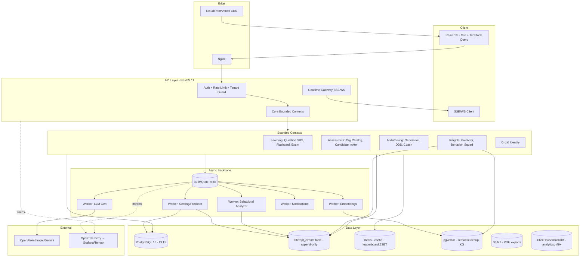

# Tech Lead Architecture Roadmap — CertGym (Brain Gym)

> Deliverable từ **Tech Lead / Software Architect** trong sprint planning team.

---

## 1. Current State Assessment

Đọc thực tế từ `backend/prisma/schema.prisma` (≈975 dòng, 40+ models) và `backend/src/app.module.ts` (24 modules):

- **Strength — Domain coverage rộng**: schema đã cover B2C (Question, Exam, Attempt, Flashcard, ReviewSchedule SM-2), AI bank (SourceMaterial, SourceChunk, QuestionGenerationJob, UserLlmConfig với encryptedKey), B2B (Organization, OrgMember, OrgGroup, ExamCatalogItem, LearningTrack, Assessment, CandidateInvite). Đây là tài sản lớn — không cần làm lại nền.
- **Strength — Module boundary backend đã rõ**: 24 NestJS modules tách theo domain (auth, exams, attempts, flashcards, ai-question-bank, organizations, org-questions, exam-catalog, assessments, org-analytics). Có chỗ để gắn DDD context map mà không phải rewrite.
- **Strength — FE pattern thống nhất**: Axios interceptor + token refresh tập trung ở `src/services/api.ts`, TanStack Query cho server state, Zustand cho client state. Pattern này scale tốt khi thêm feature mới.
- **Weakness — Loose TypeScript**: `noImplicitAny: false` + `strictNullChecks: false`. Khi đụng vào ML/predictor (số liệu), coach AI (chat schema), event sourcing (typed events) thì sẽ ăn lỗi runtime. Phải có kế hoạch siết dần.
- **Weakness — Không có event store**: `Answer`, `ExamAttempt` lưu kết quả tổng hợp (totalCorrect, score, domainScores JSON). Không có bảng event chi tiết per-keystroke / per-question để feed Pass Predictor và Burnout Detection. Đây là blocker số 1 cho roadmap.
- **Weakness — Không có job queue**: `QuestionGenerationJob` có status PENDING/PROCESSING/COMPLETED/FAILED nhưng không thấy BullMQ/Redis queue trong `app.module.ts`. Nghi ngờ đang chạy in-process — không scale, không retry chuẩn, không backoff.
- **Weakness — Chưa có realtime layer**: không có WS/SSE module. Training Squads leaderboard, AI Coach streaming, live exam monitoring (Assessment có `tabSwitchCount` nhưng chỉ ghi sau submit) đều cần.
- **Debt — SRS chỉ áp cho Flashcard**: có cả `ReviewSchedule` (cho Question) và `FlashcardReviewSchedule` — schema đã tách 2 bảng, nhưng FE/BE service hiện chỉ wire flashcards. Phần Question SRS gần như là dead code.
- **Debt — Multi-tenant isolation chưa enforce ở DB level**: dùng `orgId` filter ở service layer, không có Postgres RLS. Dễ rò rỉ khi quên `where: { orgId }` ở 1 query.
- **Debt — `Exam.create` shuffle bằng `Math.random()`** (xem `exams.service.ts:29`): không deterministic, không seeded, không kiểm soát difficulty distribution dù schema có `difficultyDist Json`. Khi thêm Adaptive / DDS sẽ phải refactor.
- **Debt — Throttler global 300/min duy nhất** (`app.module.ts:34`): không phân biệt LLM endpoint (cần stricter), public read (lỏng hơn), auth (chống brute force).

---

## 2. Target Architecture (12-Month Horizon)



**Bounded contexts (DDD-ish):**

| Context              | Owns                                   | Key Aggregates                                                           | Talks to                       |
| -------------------- | -------------------------------------- | ------------------------------------------------------------------------ | ------------------------------ |
| **Identity & Org**   | User, Auth, Org, Member, Group, Invite | `User`, `Organization`                                                   | Tất cả (via JWT claims)        |
| **Learning**         | Cá nhân học                            | `Question`, `Exam`, `ExamAttempt`, `Deck`, `Flashcard`, `ReviewSchedule` | Insights (publish events)      |
| **AI Authoring**     | Sinh & edit content                    | `SourceMaterial`, `GenerationJob`, `OrgQuestion`                         | Vector DB, LLM                 |
| **Assessment (B2B)** | Tuyển dụng & track                     | `Assessment`, `CandidateInvite`, `ExamCatalogItem`, `LearningTrack`      | Learning (read), Notifications |
| **Insights**         | Predictor, behavior, squad, KG         | `AttemptEvent` (read-only consumer), `ReadinessScore`, `BurnoutSignal`   | Event store, Vector DB         |
| **Realtime**         | SSE/WS fanout                          | session-bound                                                            | Redis pub/sub                  |

**Layer mới cần thêm:**

1. **Event store** — bảng `attempt_events` append-only (xem §4).
2. **Job queue** — BullMQ trên Redis hiện có; tách worker process khỏi API.
3. **ML/Inference** — service riêng (Nest worker hoặc Python FastAPI) chạy heuristic/scikit-learn cho Pass Predictor; bắt đầu bằng heuristic, swap được.
4. **Realtime** — SSE cho leaderboard/coach (đơn giản, scale tốt với Nginx); WS chỉ khi cần bidi (Assessment proctoring live).
5. **Vector layer** — `pgvector` extension trong cùng Postgres để KISS, migrate sang Qdrant nếu >5M vectors.
6. **Observability** — OpenTelemetry SDK trong Nest, export OTLP → Grafana stack.

---

## 3. RFC List Q2–Q3

| ID      | Title                                  | Problem                                                                                                                                   | Owner             | Deadline   | Dependencies     | Status   |
| ------- | -------------------------------------- | ----------------------------------------------------------------------------------------------------------------------------------------- | ----------------- | ---------- | ---------------- | -------- |
| RFC-001 | AttemptEvent Schema & Ingestion        | Hiện chỉ có `Answer` aggregate. Cần event chi tiết (focus, blur, choice_changed, marked, time_per_question) để feed predictor & behavior. | Tech Lead         | 2026-05-15 | Không            | Draft    |
| RFC-002 | Question SRS Activation                | `ReviewSchedule` đã có schema nhưng không được FE/BE wire. Cần hook vào ExamAttempt completion.                                           | BE Lead           | 2026-05-22 | RFC-001          | Proposed |
| RFC-003 | Pass Predictor v0 (Heuristic)          | Score 0–100 readiness per (user, certification). Bắt đầu bằng weighted heuristic, không ML.                                               | ML Champion       | 2026-06-01 | RFC-001, RFC-002 | Proposed |
| RFC-004 | BullMQ Job Queue Foundation            | Move LLM generation, email, embeddings sang queue. Define job schema, retry, DLQ.                                                         | Platform          | 2026-05-10 | Không            | Proposed |
| RFC-005 | Realtime Gateway (SSE-first)           | Leaderboard, AI Coach streaming, live notifications. Chọn SSE vì stateless, work với Nginx/HTTP2.                                         | FE+BE             | 2026-06-10 | RFC-004          | Proposed |
| RFC-006 | Postgres RLS for Multi-Tenant          | Enforce org isolation ở DB layer thay vì service. Giảm rủi ro rò rỉ.                                                                      | Security Champion | 2026-06-20 | Không            | Proposed |
| RFC-007 | pgvector Setup + Semantic Dedup        | Embedding cho Question để chống duplicate khi LLM generate, làm nền cho Knowledge Graph.                                                  | AI Lead           | 2026-06-15 | RFC-004          | Proposed |
| RFC-008 | Behavioral Insights Pipeline           | Worker đọc AttemptEvent → tính burnout score (low accuracy + high session length + late-night).                                           | ML Champion       | 2026-07-01 | RFC-001, RFC-004 | Proposed |
| RFC-009 | TypeScript Strict Migration Plan       | Bật `strictNullChecks` từng module. Score-driven (track lỗi).                                                                             | Tech Lead         | 2026-05-30 | Không            | Proposed |
| RFC-010 | Dynamic Difficulty Scaling Spec        | LLM rewrite distractors khi user mastery cao. Cần audit trail + rollback.                                                                 | AI Lead           | 2026-07-15 | RFC-007          | Proposed |
| RFC-011 | Training Squad Subtype on Organization | Squad là `Organization` nhẹ, không kế thừa Catalog/Assessment. Schema diff & permission matrix.                                           | BE Lead           | 2026-07-10 | RFC-005          | Proposed |
| RFC-012 | LLM Cost & Quota Layer                 | Per-user, per-org quota; track tokens/cost ở `QuestionGenerationJob` (đã có cột) + extend cho Coach.                                      | Platform          | 2026-06-25 | RFC-004          | Proposed |

---

## 4. Schema Changes Plan

### Models mới

```prisma
// RFC-001: Event sourcing cho attempt
model AttemptEvent {
  id           BigInt   @id @default(autoincrement())
  attemptId    String   @map("attempt_id")
  userId       String   @map("user_id")
  questionId   String?  @map("question_id")
  eventType    String   @map("event_type") // QUESTION_VIEWED, CHOICE_SELECTED, MARKED, FOCUS_LOST, SUBMITTED
  payload      Json
  clientTs     DateTime @map("client_ts")
  serverTs     DateTime @default(now()) @map("server_ts")

  @@index([attemptId, serverTs])
  @@index([userId, eventType, serverTs])
  @@map("attempt_events")
}

// RFC-003: Pass Predictor output
model ReadinessScore {
  id              String   @id @default(uuid())
  userId          String   @map("user_id")
  certificationId String   @map("certification_id")
  score           Int      // 0-100
  confidence      Decimal  @db.Decimal(4, 3)
  signals         Json     // { srsCoverage, recentAccuracy, timePressure, domainGaps }
  computedAt      DateTime @default(now()) @map("computed_at")
  @@unique([userId, certificationId])
  @@index([certificationId, score])
  @@map("readiness_scores")
}

// RFC-008: Behavioral signals
model BurnoutSignal {
  id         String   @id @default(uuid())
  userId     String   @map("user_id")
  level      String   // GREEN/YELLOW/RED
  reasons    Json
  windowDays Int      @map("window_days")
  detectedAt DateTime @default(now()) @map("detected_at")
  @@index([userId, detectedAt])
  @@map("burnout_signals")
}

// RFC-007: Vector embeddings
// Cần migration raw để bật extension + cột vector
// CREATE EXTENSION IF NOT EXISTS vector;
model QuestionEmbedding {
  questionId String  @id @map("question_id")
  modelId    String  @map("model_id") // 'text-embedding-3-small' (1536 dim)
  // pgvector column added via raw SQL migration
  // embedding  vector(1536)
  updatedAt  DateTime @updatedAt @map("updated_at")
  @@map("question_embeddings")
}

// RFC-010: DDS audit
model QuestionVariant {
  id           String   @id @default(uuid())
  questionId   String   @map("question_id")
  variantOf    String?  @map("variant_of")
  rewriteJobId String?  @map("rewrite_job_id")
  reason       String   // DDS_HARDEN, DDS_SOFTEN, MANUAL
  diff         Json
  createdAt    DateTime @default(now()) @map("created_at")
  @@index([questionId])
  @@map("question_variants")
}

// RFC-012: LLM usage ledger
model LlmUsageEvent {
  id            BigInt   @id @default(autoincrement())
  userId        String   @map("user_id")
  orgId         String?  @map("org_id")
  feature       String   // GENERATION, COACH, DDS, EMBEDDING
  provider      LlmProvider
  modelId       String   @map("model_id")
  promptTokens  Int      @map("prompt_tokens")
  outputTokens  Int      @map("output_tokens")
  costUsd       Decimal  @db.Decimal(10, 6) @map("cost_usd")
  createdAt     DateTime @default(now()) @map("created_at")
  @@index([userId, createdAt])
  @@index([orgId, createdAt])
  @@index([feature, createdAt])
  @@map("llm_usage_events")
}
```

### Migration strategy (zero-downtime)

1. **Expand–migrate–contract** cho mọi schema change:
   - Add column `NULLABLE` → backfill async qua worker → enforce `NOT NULL` ở migration sau.
2. **Append-only tables** (`attempt_events`, `llm_usage_events`): dùng Postgres native partitioning theo `serverTs` monthly. Drop partition cũ thay vì DELETE.
3. **`pgvector`**: dùng raw SQL migration (Prisma chưa hỗ trợ tốt). Tạo IVFFlat index sau khi đã có ≥10k rows.
4. **RLS rollout (RFC-006)**: bật policy ở `LOG-ONLY` mode trước (Postgres `FORCE ROW LEVEL SECURITY` off, custom audit), measure leak, sau đó enforce.

### Index & query optimization

- `attempt_events(attempt_id, server_ts)` — replay 1 attempt.
- `attempt_events(user_id, event_type, server_ts)` — behavioral worker query.
- `readiness_scores(certification_id, score DESC)` — leaderboard predictor.
- Drop redundant indexes nếu có sau khi migrate (Postgres `pg_stat_user_indexes`).
- `questions(certification_id, status)` đã có — tốt; thêm partial index `WHERE deleted_at IS NULL` để query active nhẹ hơn.

---

## 5. Infrastructure Roadmap

| Capability             | Choice                                                           | Build vs Buy                   | Lý do                                                                                          |
| ---------------------- | ---------------------------------------------------------------- | ------------------------------ | ---------------------------------------------------------------------------------------------- |
| **Job queue**          | BullMQ trên Redis 7                                              | Build (open source)            | Đã có Redis, Nest có `@nestjs/bullmq`, không add infra mới.                                    |
| **Realtime**           | SSE qua Nest controller, fallback poll                           | Build                          | Đơn giản, work với Nginx hiện tại, không cần sticky session. WS chỉ khi cần bidi (proctoring). |
| **Vector DB**          | `pgvector` (cùng Postgres)                                       | Build, migrate khi >5M vectors | Tránh thêm service. Qdrant Cloud là buy option khi scale.                                      |
| **Observability**      | OpenTelemetry SDK + Grafana Cloud (logs/metrics/traces)          | Buy                            | Self-host Grafana stack tốn người. Free tier Grafana Cloud đủ Q2–Q3.                           |
| **LLM cost tracking**  | `LlmUsageEvent` + dashboard nội bộ                               | Build                          | Đặc thù multi-provider, cần tie với org quota.                                                 |
| **Email/Notification** | Resend hoặc Postmark                                             | Buy                            | Không tự host SMTP.                                                                            |
| **Background ML**      | Nest worker với heuristic; chuyển Python FastAPI khi cần sklearn | Build                          | Bắt đầu nhẹ.                                                                                   |
| **CDN/Image**          | Cloudflare R2 + Image Resizing                                   | Buy                            | Rẻ hơn S3+CloudFront cho file giáo dục (PDF, hình question).                                   |
| **Secret manager**     | Doppler hoặc 1Password Connect                                   | Buy                            | `UserLlmConfig.encryptedKey` cần KMS đứng sau.                                                 |
| **Feature flags**      | PostHog hoặc GrowthBook                                          | Buy                            | Cần cho DDS rollout từng cohort.                                                               |

---

## 6. Tech Debt — Top 10 Prioritized

| #   | Item                                                     | Severity    | Effort          | Payoff                                      | Action                                                           |
| --- | -------------------------------------------------------- | ----------- | --------------- | ------------------------------------------- | ---------------------------------------------------------------- |
| 1   | Không có event store cho attempt                         | **Blocker** | 3 weeks         | Mở khoá Predictor + Burnout + Coach         | RFC-001 ngay Sprint 1                                            |
| 2   | LLM gen chạy in-process (no queue)                       | **Blocker** | 1 week          | Stability, retry, cost control              | RFC-004                                                          |
| 3   | Multi-tenant chỉ filter ở service layer                  | **High**    | 2 weeks         | Giảm rủi ro data leak nghiêm trọng          | RFC-006 RLS                                                      |
| 4   | `Math.random()` shuffle exam, không seed                 | **High**    | 3 days          | Reproducibility, fairness                   | Thay bằng seeded shuffle (`xorshift32`) lưu seed vào ExamAttempt |
| 5   | Loose TS (`strictNullChecks: false`)                     | **High**    | 6 weeks rolling | Bug runtime giảm, refactor an toàn hơn      | RFC-009 module-by-module                                         |
| 6   | Throttler global 300/min duy nhất                        | **High**    | 2 days          | Chống brute-force auth, bảo vệ LLM endpoint | Tách `@Throttle` per route group                                 |
| 7   | Question SRS schema có nhưng không wire                  | **Medium**  | 1 week          | Tận dụng schema sẵn, value cao              | RFC-002                                                          |
| 8   | `domainScores Json` không typed                          | **Medium**  | 3 days          | Bug khi render dashboard                    | Zod schema runtime + TS type generated                           |
| 9   | E2E test isolation (theo recent commits "fix e2e flake") | **Medium**  | 1 week          | CI reliability                              | DB snapshot/restore per test, tách worker DB                     |
| 10  | Không có audit log cho `OrgQuestion` edits               | **Low**     | 2 days          | Compliance enterprise                       | Reuse `AuditLog` model                                           |

---

## 7. Spike List — Sprint 1–2

| Spike                                     | Question                                                                                   | Timebox                          | Expected Output                                                          |
| ----------------------------------------- | ------------------------------------------------------------------------------------------ | -------------------------------- | ------------------------------------------------------------------------ |
| SP-1: Event ingestion shape               | Event payload size khi user làm bài 90 phút? Có cần batching client-side?                  | 2 ngày                           | Doc với benchmark: events/attempt, byte size, recommended batch interval |
| SP-2: BullMQ + Nest pattern               | Worker process chung repo hay tách? Deploy graph?                                          | 1 ngày                           | PoC với 1 job (email), Dockerfile cho worker                             |
| SP-3: pgvector benchmark                  | Với 50k questions, IVFFlat vs HNSW latency cho top-10 cosine?                              | 2 ngày                           | Bảng số liệu p50/p95/p99 + RAM cost                                      |
| SP-4: Pass Predictor heuristic            | Weight nào (SRS coverage, accuracy 14d, domain spread, time pressure) tương quan với pass? | 3 ngày (cần data label thủ công) | Notebook + công thức v0                                                  |
| SP-5: SSE behind Nginx                    | SSE proxy có giữ connection không? Idle timeout?                                           | 1 ngày                           | Nginx config + load test 1k concurrent                                   |
| SP-6: Strict TS pilot                     | Bật `strictNullChecks` trên `auth/` + `users/` — bao nhiêu lỗi?                            | 1 ngày                           | Lỗi count, time-to-fix estimate                                          |
| SP-7: LLM prompt injection trong AI Coach | Có bao nhiêu attack vector khi user gửi message tự do?                                     | 2 ngày                           | Threat model + mitigation list                                           |

---

## 8. Cross-Cutting Concerns

### Security

- **Multi-tenant isolation**: RFC-006 RLS bắt buộc. Set `app.current_org_id` qua `SET LOCAL` trong Prisma middleware. Test bằng adversarial integration test (User của org A query org B → expect empty/403).
- **AI prompt injection**: Coach và DDS nhận free-text. Áp `system prompt isolation` (không nhúng user input vào system role), `output schema validation` bằng Zod, deny-list cho meta-instructions ("ignore previous", "you are now…"). Log mọi prompt vào `LlmUsageEvent` để forensic.
- **PII**: Email candidate, IP address (`CandidateInvite.ipAddress`) cần data retention policy — auto-purge sau 12 tháng. Encrypt `UserLlmConfig.encryptedKey` bằng AES-GCM với key từ KMS, KHÔNG phải env var.
- **CSP & headers**: thêm `Strict-Transport-Security`, `X-Content-Type-Options: nosniff`, CSP nonce-based ở Nginx layer.
- **Rate limit per route**: `/auth/login` 5/min, `/ai-question-bank/generate` 10/hour per user, public read 300/min.

### Performance Budgets

| Surface             | Target               |
| ------------------- | -------------------- |
| API p95             | <300ms (excl. LLM)   |
| API p99             | <800ms               |
| LLM gen job         | <30s p95             |
| Predictor refresh   | <5s per user (async) |
| FE LCP              | <2.5s                |
| FE bundle (landing) | <150KB gz            |
| FE bundle (app)     | <300KB gz            |
| Exam page TTI       | <1.5s                |
| SSE message lag     | <500ms               |

### A11y baseline

- Tất cả exam UI: keyboard navigation đầy đủ (J/K cho prev/next, M cho mark, 1-4 cho choices).
- Color contrast WCAG AA (timer warning state đặc biệt — không chỉ dùng màu đỏ).
- Reduced-motion respect cho `<PageTransition>` Framer Motion.
- Aria-live cho timer (announce mỗi 5 phút cuối).
- Focus management khi modal mistake review mở.

### Cost

| Item                    | Estimate (10k MAU)              | Lever                                                            |
| ----------------------- | ------------------------------- | ---------------------------------------------------------------- |
| LLM (gen + coach + DDS) | $800–1500/tháng                 | Cache prompt, dedup câu hỏi, route Haiku/mini-model cho task nhẹ |
| Postgres (managed)      | $200–400                        | Partition `attempt_events`, archive >90 ngày sang R2             |
| Redis                   | $50                             | OK                                                               |
| pgvector                | dùng chung Postgres             | Tách instance khi >100GB                                         |
| Observability           | $0–100 (Grafana free)           | Sample traces 10%, full log lỗi                                  |
| Email                   | $30                             | OK                                                               |
| **Total**               | **~$1100–2000/tháng** ở 10k MAU |                                                                  |

LLM là biến số lớn nhất — `LlmUsageEvent` + dashboard cost-per-feature là priority.
